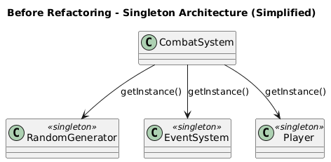
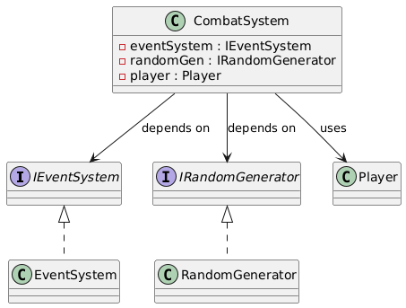

[TOC]

# Dependency Injection Pattern
## 1. Brief Introduction to Dependency Injection Pattern

### 1.1 What is Dependency Injection

**Dependency Injection (DI)** is a creational design pattern that implements Inversion of Control (IoC) for resolving dependencies. Instead of a class creating its own dependencies or using global access points (like singletons), the dependencies are "injected" from outside by a caller or container.

**Key Components:**
- **Client**: The class that needs dependencies (CombatSystem in our case)
- **Service**: The dependency being injected (RandomGenerator, EventSystem, Player)
- **Interface**: Abstract definition of the service
- **Injector**: The code that creates and injects dependencies
---

## 2. Previous Implementation and Problems

### 2.1 Original Implementation Approach

Before refactoring, the codebase heavily relied on the **Singleton Pattern** for accessing shared services like `RandomGenerator`, `EventSystem`, and `Player`.

**Example: CombatSystem Original Implementation**

```cpp
// CombatSystem.cpp - Before refactoring
void CombatSystem::init(int type) {
    // Hard-coded singleton dependencies - Tight coupling
    Player::getInstance()->init();

    // Cannot replace with mock objects for testing
    auto monster = RandomGenerator::getInstance()->getRandomMonster(ELITE);

    // Dependencies are hidden, not explicit
    EventSystem::getInstance()->changeHealth(-10);
}

// RandomGenerator.h - Singleton pattern
class RandomGenerator {
public:
    static RandomGenerator* getInstance();  // Global access point
private:
    RandomGenerator() = default;  // Private constructor
};
```

### 2.2 Problems with Original Approach

**1. Tight Coupling**
- Classes directly depend on concrete implementations
- Violates the Dependency Inversion Principle
- Difficult to swap implementations

**2. Impossible to Unit Test**

```cpp
// How to test this method?
void CombatSystem::shuffleDeck() {
    auto rng = RandomGenerator::getInstance();  // Always returns real random
    int seed = rng->getRandomNumber(0, 9999);   // Unpredictable
    // ... shuffle logic
}

// Test code cannot control random behavior
TEST(CombatSystemTest, ShuffleDeck) {
    CombatSystem combat;
    combat.shuffleDeck();
    // Cannot verify results - randomness makes it non-deterministic
}
```

**3. Hidden Dependencies**

```cpp
class CombatSystem {
public:
    void init();  // What does this method need? Not clear!

private:
    // No member variables for dependencies
    // Dependencies are hidden inside method calls to getInstance()
};
```

Looking at the class declaration, you cannot tell what dependencies `CombatSystem` requires. They're buried inside the implementation.

---

## 3. Overall Refactoring Design

### 3.1 Architecture Overview

The refactored system uses **Dependency Injection** with interfaces to decouple components and improve testability.

**Core Components:**

```
Application Entry Point
    │
    ├── Creates Dependencies
    │       ├── RandomGenerator (implements IRandomGenerator)
    │       ├── EventSystem (implements IEventSystem)
    │       └── Player
    │
    └── Injects into CombatSystem
            CombatSystem(randomGen, eventSystem, player)
                │
                ├── Uses IRandomGenerator interface
                ├── Uses IEventSystem interface
                └── Uses Player
```

### 3.2 Design Decisions

**1. Interface-Based Design**
- Created `IRandomGenerator` and `IEventSystem` interfaces
- Concrete classes implement these interfaces
- Clients depend on abstractions, not concretions

**2. Constructor Injection**
- Dependencies passed through constructor
- Explicit and type-safe
- Ensures object is fully initialized before use

**3. Backward Compatibility**
- Kept singleton methods for legacy code
- Gradual migration path
- No breaking changes to existing systems

### 3.3 UML Class Diagram

#### Before Refactoring (Singleton-Based Architecture)



**Key Issues:**
- **Direct dependency on concrete singletons**: CombatSystem directly calls `getInstance()` on concrete classes
- **No abstraction layer**: No interfaces between client and services
- **Impossible to substitute implementations**: Cannot inject mock objects for testing
- **Global state management**: All components share singleton instances
- **Hidden dependencies**: Cannot see what dependencies are needed just by looking at class declaration

---

#### After Refactoring (Dependency Injection Architecture)



**Key Improvements:**
- **Dependency on abstractions (interfaces)**: CombatSystem depends on `IRandomGenerator` and `IEventSystem` interfaces
- **Constructor injection makes dependencies explicit**: Clear from constructor signature what's needed
- **Easy to substitute mock implementations**: Can inject test doubles for unit testing
- **Testable and flexible**: Each component can be tested in isolation
- **Follows Dependency Inversion Principle**: Both high-level and low-level modules depend on abstractions
- **Backward compatible**: Singleton pattern still available for legacy code

---

## 4. Detailed Implementation

### 4.1 Core File Changes

**Involved Files:**
```
Tongji_University_Slay_the_Spire/Classes/
├── IRandomGenerator.h              (NEW - Interface)
├── IEventSystem.h                  (NEW - Interface)
├── RandomGenerator.h               (MODIFIED - Implements interface)
├── EventSystem.h                   (MODIFIED - Implements interface)
└── CombatSystem.h                  (MODIFIED - Constructor injection)
└── CombatSystem.cpp                (MODIFIED - Uses injected dependencies)
```

### 4.2 Interface Definitions

#### IRandomGenerator Interface

**Purpose:** Abstract interface for random number generation services, decoupling clients from concrete implementation.

```cpp
// Refactored with Dependency Injection Pattern
class IRandomGenerator {
public:
    virtual ~IRandomGenerator() = default;

    virtual void initializeGenerators(std::string seeds) = 0;
    virtual void initializeGenerators() = 0;
    virtual unsigned int getInitialSeed() = 0;
    virtual int getRandomNumber(int min, int max) = 0;
    virtual std::shared_ptr<Card> getRandomCard(int type = ALL, int rarity = ALL) = 0;
    virtual std::shared_ptr<Monster> getRandomMonster(int type = NORMAL) = 0;
    virtual std::shared_ptr<Relic> getRandomRelic(int rarity = ALL) = 0;
    virtual std::shared_ptr<Potion> getRandomPotion() = 0;
};
```

**Key Design Points:**
- **Pure virtual functions**: All methods are abstract, enforcing implementation
- **No data members**: Interfaces should not contain state
- **Virtual destructor**: Ensures proper cleanup in polymorphic scenarios

**Why This Matters:**
- **Testability**: Can create `MockRandomGenerator` that implements this interface
- **Flexibility**: Can swap implementations without changing client code
- **Decoupling**: Clients depend on interface, not concrete class

---

#### IEventSystem Interface

**Purpose:** Abstract interface for player state and event management.

```cpp
// Refactored with Dependency Injection Pattern
class IEventSystem {
public:
    virtual ~IEventSystem() = default;

    virtual int getCurrentHealth() const = 0;
    virtual int getFullHealth() const = 0;
    virtual int getCoins() const = 0;
    virtual void changeHealth(int delta) = 0;
    virtual int changeCoins(int delta) = 0;
    virtual void changeMaxHealth(int delta) = 0;
    virtual void addCard(std::shared_ptr<Card> card) = 0;
    virtual int addPotion(std::shared_ptr<Potion> potion) = 0;
    virtual void addRelic(std::shared_ptr<Relic> relic) = 0;
    virtual int upgradeCard(std::shared_ptr<Card> card) = 0;
    virtual int deleteCard(std::shared_ptr<Card> card) = 0;
};
```

**Interface Methods Explained:**
- **Const methods** (`getCurrentHealth()`): Read-only operations, don't modify state
- **Mutation methods** (`changeHealth()`): Modify player state
- **Return values**: Some methods return status codes for error handling

---

### 4.3 Concrete Implementation Classes

#### RandomGenerator Implementation

```cpp
// RandomGenerator.h - BEFORE
class RandomGenerator {
public:
    static RandomGenerator* getInstance();
    int getRandomNumber(int min, int max);
private:
    RandomGenerator() = default;
};

// RandomGenerator.h - AFTER (Refactored with Dependency Injection Pattern)
class RandomGenerator : public IRandomGenerator {
public:
    // Singleton kept for backward compatibility
    static RandomGenerator* getInstance();

    // Interface implementations
    int getRandomNumber(int min, int max) override;
    std::shared_ptr<Card> getRandomCard(int type = ALL, int rarity = ALL) override;
    std::shared_ptr<Monster> getRandomMonster(int type = NORMAL) override;
    // ... other interface methods

private:
    RandomGenerator() = default;
    unsigned int initialSeed_;
    std::mt19937 rng[3];
};
```

**Changes Made:**
1. **Inherits from `IRandomGenerator`**: Now implements the interface contract
2. **`override` keyword**: Explicitly marks interface method implementations
3. **Singleton preserved**: `getInstance()` kept for backward compatibility with legacy code
4. **No breaking changes**: Existing code using singleton pattern still works

---

#### EventSystem Implementation

```cpp
// EventSystem.h - AFTER (Refactored with Dependency Injection Pattern)
class EventSystem : public Node, public IEventSystem {
private:
    static EventSystem* instance;  // Singleton for legacy code

public:
    // Interface implementations
    int getCurrentHealth() const override;
    int getFullHealth() const override;
    int getCoins() const override;
    void changeHealth(int delta) override;
    int changeCoins(int delta) override;
    void changeMaxHealth(int delta) override;
    void addCard(std::shared_ptr<Card> card) override;
    int addPotion(std::shared_ptr<Potion> potion) override;
    void addRelic(std::shared_ptr<Relic> relic) override;
    int upgradeCard(std::shared_ptr<Card> card) override;
    int deleteCard(std::shared_ptr<Card> card) override;

    // Singleton access (legacy)
    static EventSystem* getInstance();

    // Other methods...
};
```

**Design Notes:**
- **Multiple inheritance**: Inherits from both `Node` (Cocos2d) and `IEventSystem`
- **Backward compatible**: Singleton pattern still available
- **Override all interface methods**: Compiler enforces this

---

### 4.4 CombatSystem Refactoring

#### Header File Changes

```cpp
// CombatSystem.h - AFTER (Refactored with Dependency Injection Pattern)
class CombatSystem {
public:
    // Legacy singleton (for backward compatibility)
    static CombatSystem* getInstance();

    // NEW: Constructor injection
    CombatSystem(std::shared_ptr<IRandomGenerator> randomGen,
                 std::shared_ptr<IEventSystem> eventSystem,
                 std::shared_ptr<Player> player);
	//...
private:
    static CombatSystem* instance_;
    // NEW: Injected dependencies (stored as interfaces!)
    std::shared_ptr<IRandomGenerator> randomGen_;
    std::shared_ptr<IEventSystem> eventSystem_;
    std::shared_ptr<Player> player_;
    int round_;
};
```

**Key Changes:**
1. **New constructor**: Accepts dependencies as parameters
2. **Member variables**: Dependencies stored as `shared_ptr` to interfaces
3. **Explicit dependencies**: Just by looking at constructor, you know what's needed
4. **Backward compatible**: Default constructor + singleton still exist

---

---

## 5. Advantages of Refactored Design

### 5.1 Testability with Mock Objects


The original singleton-based implementation made unit testing nearly impossible. With dependency injection, we can now easily inject mock objects for testing.

**Before: Impossible to Test**

```cpp
// Cannot control random behavior - tests are non-deterministic
TEST(CombatSystemTest, ShuffleDeck) {
    CombatSystem combat;
    combat.shuffleDeck();
    // Cannot verify results - real RandomGenerator used
}
```

**After: Easy to Test with Mocks**

```cpp
class MockRandomGenerator : public IRandomGenerator {
private:
    int fixedValue_;
public:
    MockRandomGenerator(int value) : fixedValue_(value) {}
    
    int getRandomNumber(int min, int max) override {
        return fixedValue_;  // Always return fixed value
    }
    
    template<typename T>
    void shuffleVector(std::vector<T>& vec) override {
        // Do nothing - keep order for predictable testing
    }
};

TEST(CombatSystemTest, ShuffleDeck_Deterministic) {
    auto mockRng = std::make_shared<MockRandomGenerator>(5);
    auto mockEvents = std::make_shared<MockEventSystem>();
    auto mockPlayer = std::make_shared<MockPlayer>();
    
    CombatSystem combat(mockRng, mockEvents, mockPlayer);
    combat.shuffleDeck();
    
    // Now we can verify results - behavior is deterministic!
}
```

---

### 5.2 Explicit Dependencies

In the original implementation, dependencies were hidden inside method calls to `getInstance()`. Just by looking at the class declaration, you couldn't tell what dependencies were needed.

**Before: Hidden Dependencies**

```cpp
class CombatSystem {
public:
    void init();  // What does this need? Not clear!
    
private:
    // No dependency member variables visible
};
```

**After: Explicit Dependencies**

```cpp
class CombatSystem {
public:
    // Dependencies are crystal clear from constructor
    CombatSystem(std::shared_ptr<IRandomGenerator> randomGen,
                 std::shared_ptr<IEventSystem> eventSystem,
                 std::shared_ptr<Player> player);
    
private:
    std::shared_ptr<IRandomGenerator> randomGen_;
    std::shared_ptr<IEventSystem> eventSystem_;
    std::shared_ptr<Player> player_;
};
```

Just by reading the constructor signature, you immediately know that `CombatSystem` requires a random generator, event system, and player object.

---

### 5.3 Flexibility in Implementation Switching

```cpp
// Production code - use real random generator
auto realRng = std::make_shared<RandomGenerator>();
auto combat = std::make_shared<CombatSystem>(realRng, eventSys, player);

// Testing code - use deterministic random generator
auto fakeRng = std::make_shared<FixedRandomGenerator>(42);
auto combat = std::make_shared<CombatSystem>(fakeRng, eventSys, player);

// Replay system - use seeded RNG for deterministic replay
auto seededRng = std::make_shared<SeededRandomGenerator>("save_12345");
auto combat = std::make_shared<CombatSystem>(seededRng, eventSys, player);

// Different game modes - custom behavior
auto easyModeRng = std::make_shared<BiasedRandomGenerator>(0.7);  // 70% favorable
auto combat = std::make_shared<CombatSystem>(easyModeRng, eventSys, player);
```

All these different implementations work seamlessly because they all implement the same `IRandomGenerator` interface.

---
