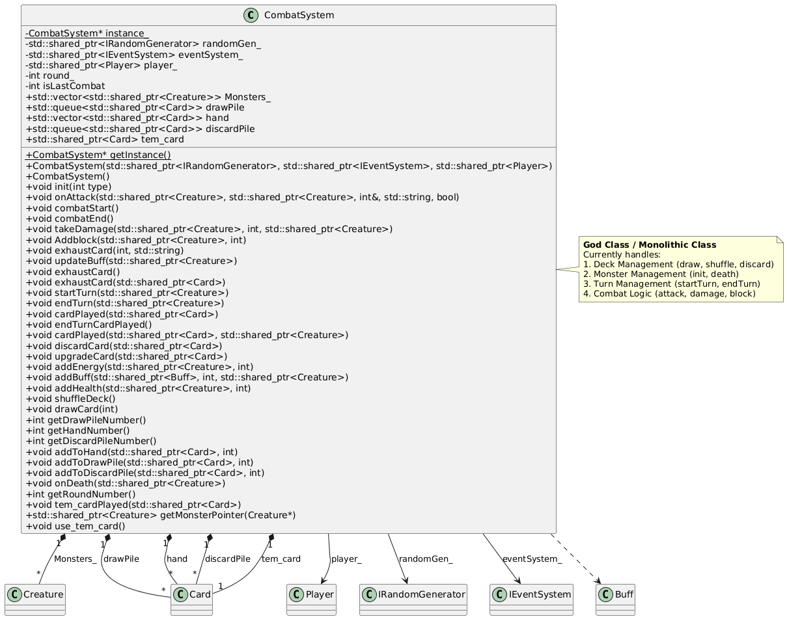
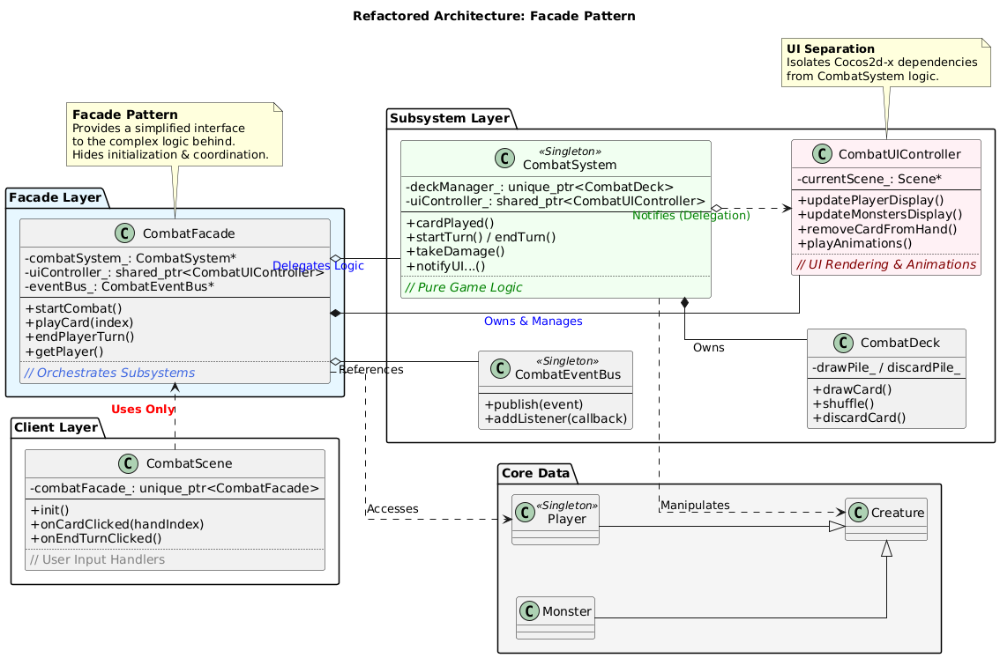

[TOC]

# Facade Pattern

## 1. Brief Introduction to Facade Pattern

### 1.1 What is Facade Pattern

The **Facade Pattern** is a structural design pattern that provides a simplified interface to a library, a framework, or any other complex set of classes. It defines a higher-level interface that makes the subsystem easier to use by wrapping a complicated subsystem with a simpler interface.

**Key Components:**
- **Facade**: The unified interface that clients interact with (CombatFacade in our case)
- **Subsystems**: The complex internal components hidden behind the Facade (CombatSystem, CombatUIController, CombatEventBus)
- **Client**: The code that uses the Facade instead of interacting with subsystems directly (CombatScene)

---

## 2. Previous Implementation and Problems

### 2.1 Original Implementation Approach

Before refactoring, `CombatScene` had to interact directly with multiple subsystems (`CombatSystem`, `Player`, `Monster`, `HandPileLayer`) to perform any combat operation.

**Example: Ending a Turn (Original Implementation)**

```cpp
// CombatScene.cpp - 20+ lines of coordination logic
endTurnButton->addTouchEventListener([&](Ref* sender, Widget::TouchEventType type) {
    if (type == Widget::TouchEventType::ENDED) {
        if (isMyTurn) {
            isMyTurn = 0;
            CombatSystem::getInstance()->endTurnCardPlayed();  // Step 1
            CombatSystem::getInstance()->endTurn(Player::getInstance());  // Step 2
            
            // Step 3-6: Manually iterate all monsters
            for (int i = 0; i < CombatSystem::getInstance()->Monsters_.size(); i++) {
                auto monster = static_pointer_cast<Monster>(
                    CombatSystem::getInstance()->Monsters_[i]);
                if (monster->getHealth() > 0) {
                    CombatSystem::getInstance()->startTurn(monster);
                    monster->takeEffect();
                    CombatSystem::getInstance()->endTurn(monster);
                }
            }
        }
        CombatSystem::getInstance()->startTurn(Player::getInstance());  // Step 7
        isMyTurn = 1;
    }
});
```

### 2.2 Problems with Original Approach

**1. Tight Coupling**
- Client knows internal structure (monster list, turn sequence)
- Must call 7 different methods in correct order
- Any change to turn logic requires modifying client code

**2. Code Duplication**
- Same coordination logic repeated if other scenes need turn management
- Error-prone: easy to forget a step (e.g., skip dead monsters)

**3. Mixed Responsibilities**
- CombatSystem contains both game logic AND direct UI calls
- Cannot test game logic without instantiating Cocos2d-x UI framework

**4. Direct UI Dependencies in CombatSystem**
```cpp
// Before: CombatSystem directly calls UI layer
auto scene = (CombatScene*)(Director::getInstance()->getRunningScene());
scene->creatureLayer->updateDisplay();  // Cocos2d dependency!
HandPileLayer::getInstance()->removeCard(card);  // Singleton UI access
```


---

## 3. Overall Refactoring Design

### 3.1 Architecture Overview

The refactored system introduces **CombatFacade** as the single entry point for all combat-related operations. We also extracted UI logic into **CombatUIController** and event handling into **CombatEventBus**.

**Core Components:**

```
Client (CombatScene)
    │
    └── CombatFacade (Single Entry Point)
            │
            ├── CombatSystem (Pure Game Logic)
            │       ├── Damage calculation
            │       ├── Turn management
            │       └── Card/Buff effects
            │
            ├── CombatUIController (UI Abstraction)
            │       ├── Player/Monster display
            │       └── Animations
            │
            └── CombatEventBus (Event System)
                    └── Publish-Subscribe events
```

### 3.2 Design Decisions

**1. Facade as Orchestrator**
- CombatFacade coordinates between subsystems
- Clients only interact with Facade
- All UI updates are automatic

**2. UI Controller Extraction**
- All Cocos2d-x specific code moved to CombatUIController
- CombatSystem uses `notifyUI*()` methods to delegate UI updates:
  - `notifyUICreaturesUpdated()` - Update creature displays
  - `notifyUIRemoveCard()` - Remove card from hand
  - `notifyUIDiscardPileUpdated()` - Update discard pile
- **20+ direct UI calls replaced** with UIController delegation

**3. Event Bus for Decoupling**
- Components communicate via events (Publish-Subscribe pattern)
- Easy to add new listeners (achievements, analytics, etc.)

**4. Backward Compatibility**
- Singletons kept for legacy code
- Gradual migration path

### 3.3 UML Class Diagram

#### Before Refactoring (Direct Coupling)



**Key Issues:**
- CombatScene directly depends on 4+ subsystems
- CombatSystem contains both logic AND UI calls
- Cannot test logic without UI framework

---

#### After Refactoring (Facade Pattern)



**Key Improvements:**
- Client only depends on CombatFacade
- CombatSystem delegates all UI through `notifyUI*()` methods
- Clear separation: Logic / UI / Events

---

## 4. Implementation Details

### 4.1 Core File Changes

```
Tongji_University_Slay_the_Spire/Classes/
├── CombatFacade.h/cpp        (NEW - Facade interface)
├── CombatUIController.h/cpp  (NEW - UI abstraction)
├── CombatEventBus.h/cpp      (NEW - Event system)
└── CombatSystem.h/cpp        (MODIFIED - UI delegation)
```

### 4.2 CombatFacade Interface

```cpp
class CombatFacade {
public:
    static std::unique_ptr<CombatFacade> create();

    // Combat Flow
    void startCombat(int combatType = -1);
    void endCombat();
    void startPlayerTurn();
    void endPlayerTurn();
    
    // Card Operations
    bool playCard(int handIndex);
    bool playCardWithTarget(int handIndex, int targetIndex);
    int drawCard(int count = 1);
    void discardCard(int handIndex);

    // Combat Actions
    int playerAttack(int targetIndex, int damage);
    void playerDefend(int blockAmount);
    void playerAddBuff(const std::string& buffName, int stacks = 1);

    // Query Interface
    std::shared_ptr<Player> getPlayer() const;
    std::vector<std::shared_ptr<Monster>> getMonsters() const;
    std::vector<std::shared_ptr<Card>> getPlayerHand() const;
    bool canPlayCard(int handIndex) const;

private:
    CombatSystem* combatSystem_;
    std::shared_ptr<CombatUIController> uiController_;
    CombatEventBus* eventBus_;
};
```

### 4.3 Key Method: playCard()

```cpp
bool CombatFacade::playCard(int handIndex) {
    // 1. Validate state
    if (!isCombatActive_ || !isPlayerTurn_) return false;
    
    // 2. Validate card
    auto hand = getPlayerHand();
    if (handIndex < 0 || handIndex >= hand.size()) return false;
    
    auto card = hand[handIndex];
    if (card->getEnergyCost() > getPlayer()->getCurrentEnergy()) return false;

    // 3. Execute logic
    combatSystem_->cardPlayed(card);

    // 4. Update UI (automatic)
    if (uiController_) {
        uiController_->removeCardFromHand(card);
        uiController_->updatePlayerDisplay(getPlayer());
    }

    // 5. Publish event
    eventBus_->publishCardPlayed(card->getName(), handIndex);
    return true;
}
```

---

### 4.4 CombatUIController

Isolates all Cocos2d-x specific code:

```cpp
class CombatUIController {
public:
    static std::unique_ptr<CombatUIController> create();
    bool init(cocos2d::Scene* scene);

    // Display Updates
    void updatePlayerDisplay(std::shared_ptr<Player> player);
    void updateMonstersDisplay(const std::vector<std::shared_ptr<Monster>>& monsters);
    void updateAllCreaturesDisplay();
    void updateEnergyDisplay(int current, int max);
    void updateDiscardPileDisplay(int count);

    // Card Operations
    void addCardToHand(std::shared_ptr<Card> card);
    void removeCardFromHand(std::shared_ptr<Card> card);
    void removeCardSprite(std::shared_ptr<Card> card);

private:
    cocos2d::Scene* currentScene_ = nullptr;
    HandPileLayer* handLayer_ = nullptr;
    CreatureLayer* creatureLayer_ = nullptr;
    
    void safeUpdateUI(std::function<void()> updateFunc);
};
```

---

### 4.5 CombatEventBus

Implements Publish-Subscribe pattern for loose coupling:

```cpp
class CombatEventBus {
public:
    static CombatEventBus* getInstance();
    
    // Listener Management
    int addListener(int eventType, EventListener listener, int priority = 0);
    bool removeListener(int listenerId);
    
    // Event Publishing
    void publish(int eventType, std::shared_ptr<void> data = nullptr);
    void publishCardPlayed(const std::string& cardName, int handIndex);
    void publishTurnEvent(bool isPlayerTurn, int roundNumber);
};

// Event Types
namespace CombatEventType {
    const int CARD_PLAYED = 1001;
    const int ATTACK = 1002;
    const int DAMAGE_TAKEN = 1003;
    const int TURN_START = 1005;
    const int COMBAT_END = 1008;
}
```

---

## 5. Advantages

### 5.1 Simplified Client Code

**Before (20+ lines):**
```cpp
void CombatScene::onCardPlayed(Card* card) {
    if (Player::getInstance()->getCurrentEnergy() < card->getCost()) return;
    Player::getInstance()->energyChange(-card->getCost());
    CombatSystem::getInstance()->cardPlayed(card);
    this->creatureLayer->updateDisplay();
    HandPileLayer::getInstance()->removeCard(card);
    HandPileLayer::getInstance()->updateEnergyDisplay();
    // ... more UI updates
}
```

**After (1 line):**
```cpp
void CombatScene::onCardPlayed(int handIndex) {
    combatFacade_->playCard(handIndex);  // All handled!
}
```

### 5.2 Complete UI/Logic Separation

| Metric | Before | After |
|:-------|:-------|:------|
| Direct UI calls in CombatSystem | 20+ | 0 |
| `notifyUI*()` delegation methods | 0 | 10+ |
| Unit testability | ❌ | ✅ |

---

### 5.3 UI Delegation Pattern

```cpp
// CombatSystem - Pure logic, no Cocos2d dependencies
void CombatSystem::endTurn(std::shared_ptr<Creature> creature) {
    // Game logic...
    for (auto& card : hand) {
        discardPile.push(card);
        notifyUIRemoveCardSprite(card);  // Delegation, not direct call
    }
    notifyUICreaturesUpdated();  // Replaces scene->creatureLayer->updateDisplay()
}

void CombatSystem::notifyUICreaturesUpdated() {
    if (uiController_) {
        uiController_->updateAllCreaturesDisplay();
    }
}
```

### 5.4 Testability

```cpp
class MockUIController : public CombatUIController {
public:
    void updatePlayerDisplay(std::shared_ptr<Player>) override { updateCount++; }
    int updateCount = 0;
};

TEST(CombatTest, PlayCardUpdatesUI) {
    auto mockUI = std::make_shared<MockUIController>();
    auto facade = createTestFacade(mockUI);
    facade->playCard(0);
    EXPECT_EQ(mockUI->updateCount, 1);  // Verifiable!
}
```

### 5.5 Event-Driven Extensions

```cpp
// Add features without modifying Facade!
facade->addEventListener(CombatEventType::CARD_PLAYED, 
    [](auto& e) { AudioEngine::play2d("card.mp3"); });
```

---

## 6. Trade-offs

### 6.1 Advantages Summary

| Benefit | Description |
|:--------|:------------|
| **Simplified API** | 30+ lines → 1 line per operation |
| **UI Separation** | 20+ direct calls → 0 (all delegated) |
| **Testability** | Can mock UIController for unit tests |
| **Extensibility** | Add features via events, no code changes |

### 6.2 Limitations

**1. CombatSystem Remains a God Object (~950 lines)**
- Facade **wraps** complexity, doesn't **eliminate** it
- Further decomposition (DamageCalculator, TurnManager, etc.) deferred

**2. Additional Abstraction Layer**
- ~1000 lines of new code (Facade + UIController + EventBus)
- Learning curve for new developers

**3. Backward Compatibility Constraints**
- Singletons remain directly accessible
- `getSelectedCards()` has fallback for null `uiController_`

---

## 7. Conclusion

### Summary

| Component | Purpose | Lines |
|:----------|:--------|:------|
| **CombatFacade** | Unified interface, orchestration | ~400 |
| **CombatUIController** | UI abstraction | ~400 |
| **CombatEventBus** | Publish-subscribe events | ~200 |

### Results

| Metric | Before | After |
|:-------|:-------|:------|
| Client code complexity | 20+ lines | 1 line |
| Direct UI calls in CombatSystem | 20+ | 0 |
| Unit testability | ❌ | ✅ |

### Key Insight

```
Facade = "Make the client's life easier without rewriting the world"
UI Separation = "Make the logic testable without UI dependencies"
```

**Two-Layer Improvement:**
1. **External**: CombatScene ↔ CombatFacade ↔ Subsystems
2. **Internal**: CombatSystem → notifyUI*() → CombatUIController

**Future Work:**
- Decompose CombatSystem into smaller classes (DamageCalculator, TurnManager, etc.)
- Remove singleton dependencies
- Add comprehensive unit test suite
