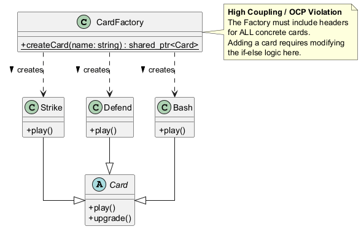
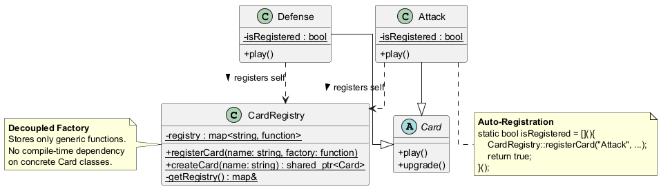
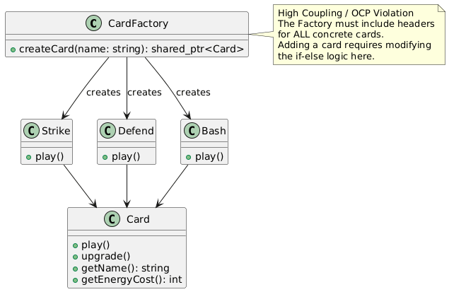
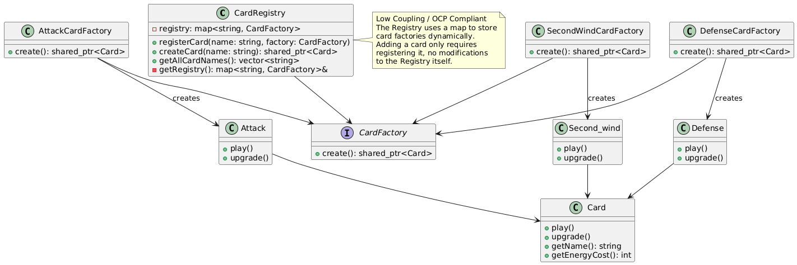
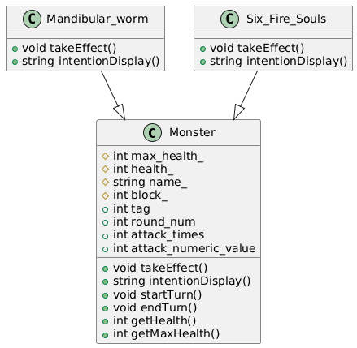
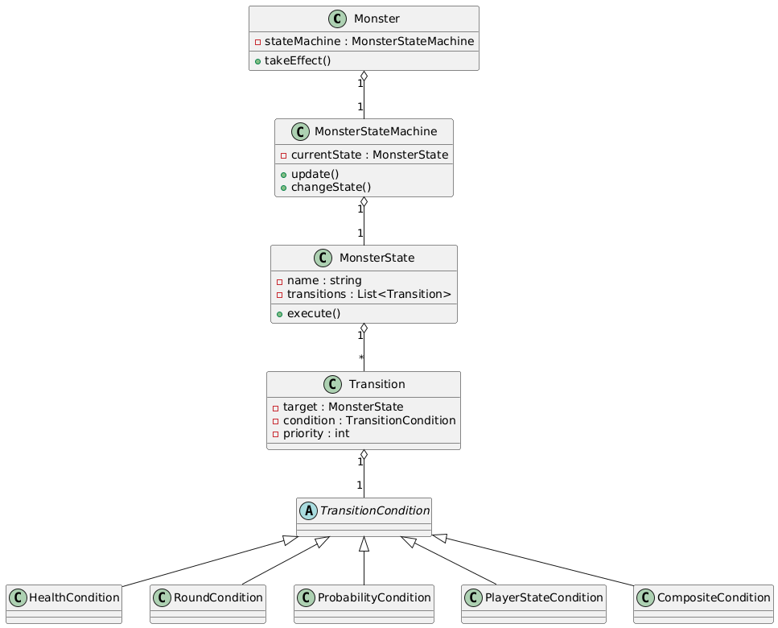
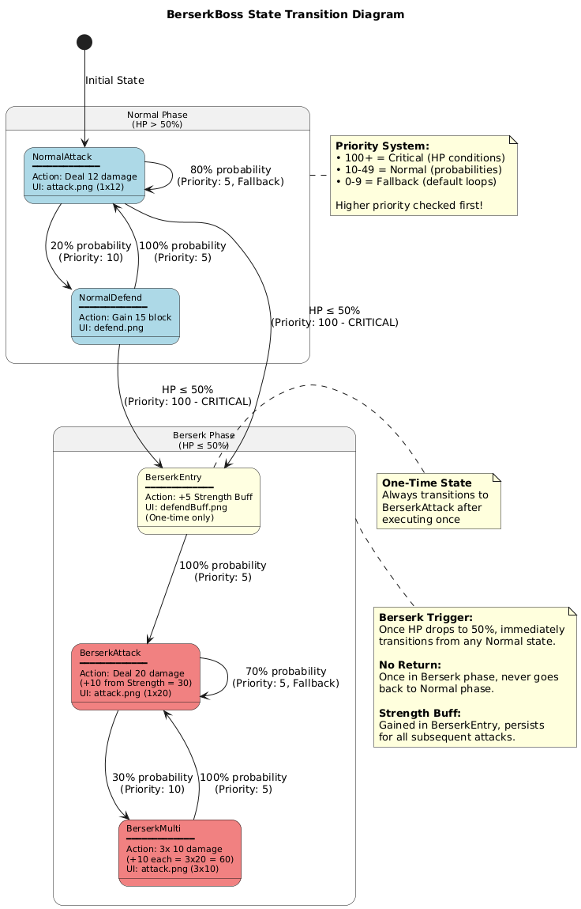

# Project Report: Software Design Patterns Refactoring

[TOC]

## 1. Project Information
**Project Name:** Slay the Spire Refactoring Project
**Team Number:** [Team Number]
**Members:**
- [Member 1 Name] (Matriculation No: [Number])
- [Member 2 Name] (Matriculation No: [Number])
- [Member 3 Name] (Matriculation No: [Number])

**Contact Information:**
- Email: [Email Address]
- Phone: [Phone Number]

## 2. Project Description
**Background:**
This project is a comprehensive refactoring of a legacy C++ codebase originally developed for the "Programming Paradigms" course (Tongji University, 2023 Cohort). The target application is a roguelike deck-building game inspired by "Slay the Spire", implemented using the Cocos2d-x game engine. The primary goal of this project was to transition the codebase from a functional but rigid implementation to a flexible, maintainable, and extensible architecture using established Software Design Patterns.

**Major Functionalities:**
- **Roguelike Progression:** Procedurally generated maps with branching paths, random encounters, and permadeath.
- **Deck Building:** Players build their deck by adding cards through combat rewards, shops, and events.
- **Turn-Based Combat:** Strategic combat system involving energy management, card play, and enemy intent prediction.
- **Card System:** A diverse set of cards including Attacks, Skills, and Powers, each with unique effects and upgrade paths.
- **Relic & Potion System:** Global modifiers (Relics) and consumable items (Potions) that interact with combat mechanics.
- **Buff/Debuff System:** A complex status effect system managing temporary and permanent state changes on creatures.
- **Event System:** Interactive narrative events that offer choices with risks and rewards.

## 3. Detailed Refactoring Work
This section presents the detailed refactoring work performed on the project. Six key design patterns were implemented to address specific architectural issues: Adapter, Dependency Injection, Facade, Factory, State, and Strategy.

### 3.1. Factory Pattern Refactoring

#### 3.1.1. Brief Introduction to Factory Pattern

The **Factory Pattern** is a creational design pattern that provides an interface for creating objects in a superclass, but allows subclasses to alter the type of objects that will be created. In our context, we specifically use a **Registration-based Factory** variant (also known as Self-Registering Factory) to decouple the factory from the concrete product classes.

**Key Components:**
- **Factory Interface**: Declares the creation method (CardRegistry)
- **Concrete Products**: Different implementations of the product interface (Attack, Defense, etc.)
- **Registration Mechanism**: A way for products to register themselves with the factory automatically

#### 3.1.2. Previous Implementation and Problems

##### 3.1.2.1. Original Implementation Approach

Before refactoring, the card creation system typically relied on a monolithic conditional structure (switch or if-else chains) to instantiate the correct card class based on a string identifier or enum.

**Example: Traditional Factory (Anti-Pattern)**

```cpp
std::shared_ptr<Card> CardFactory::createCard(const std::string& name) {
    if (name == "Strike") {
        return std::make_shared<Strike>();
    } else if (name == "Defend") {
        return std::make_shared<Defend>();
    } else if (name == "Bash") {
        return std::make_shared<Bash>();
    }
    // ... hundreds of other cards
    else {
        return nullptr;
    }
}
```

##### 3.1.2.2. Problems with Original Approach

**1. Violation of Open/Closed Principle (OCP)**
- To add a new card, you must modify the `createCard` method.
- The factory class grows indefinitely as new content is added.
- High risk of merge conflicts when multiple developers add cards simultaneously.

**2. High Coupling**
- The Factory must include the headers of ALL concrete card classes.
- Any change in a concrete card class header might trigger a recompilation of the Factory and all its clients.

**3. Maintenance Nightmare**
- A single file becomes a dependency bottleneck.
- Logic is prone to errors (typos in string matching inside the huge if-else block).


#### 3.1.3. Overall Refactoring Design

##### 3.1.3.1. Architecture Overview

The refactored system uses a **Self-Registering Factory** mechanism. Instead of the factory knowing every card, each card registers itself with the factory at program startup.

**Core Components:**

```
CardRegistry (Factory)
    ├── map<string, CardFactory> registry (Stores creators)
    ├── registerCard() (Adds creator to map)
    └── createCard() (Lookups creator and executes)

ConcreteCard (Product)
    ├── Constructor
    └── Static Registration Block (AUTO_REGISTER_CARD macro)
```

##### 3.1.3.2 Design Decisions

**1. Macro-Based Registration (`AUTO_REGISTER_CARD`)**
- We use a preprocessor macro to automate the registration process.
- This hides the complexity of static variable initialization and lambda functions from the card developer.
- Usage is as simple as `AUTO_REGISTER_CARD(CardName)` in the .cpp file.

**2. Static Initialization Trick**
- We leverage C++'s static variable initialization order.
- Anonymous lambdas are executed at program startup to register factories before `main()` runs (or effectively before first use).

**3. `std::function` as Creator**
- The registry stores `std::function<std::shared_ptr<Card>()>`, allowing for flexible creation logic (e.g., using `std::make_shared`).

##### 3.1.3.3 UML Class Diagram

Before Refactoring (Simple Factory)



*(Concept: Client -> Factory -> [Depend on All Concrete Classes])*

- **Coupling**: Factory depends on CardA, CardB, CardC...
- **Flow**: `createCard("A")` -> `if "A" return new CardA()`

After Refactoring (Self-Registering Factory)



*(Concept: Concrete Classes -> [Register to] -> Factory)*

- **Decoupling**: Factory has NO compile-time dependency on Concrete Cards.
- **Flow**: 
    1. Program Start: `CardA` registers itself to `CardRegistry`.
    2. Runtime: `CardRegistry::createCard("A")` -> looks up map -> invokes registered lambda.

#### 3.1.4. Detailed Implementation

##### 3.1.4.1 Core File Changes

**Involved Files:**
```
Classes/
├── Register.h       (The Registry/Factory)
├── Enum.h           (The Registration Macro)
└── Card.cpp         (Example Usage)
```

##### 3.1.4.2. The Registry (`Register.h`)

The `CardRegistry` class manages a map of string names to creation functions.

```cpp
class CardRegistry {
public:
    using CardFactory = std::function<std::shared_ptr<Card>()>;

    // Register a card factory function
    static void registerCard(const std::string& name, CardFactory factory) {
        getRegistry()[name] = factory;
    }

    // Create a card by name
    static std::shared_ptr<Card> createCard(const std::string& name) {
        // ... (Handling upgrades logic omitted for brevity) ...
        auto& registry = getRegistry();
        auto it = registry.find(newname);
        if (it != registry.end()) {
            return it->second(); // Invoke the factory lambda
        }
        throw std::runtime_error("Card not found: " + name);
    }

private:
    // Meyer's Singleton for the map to ensure correct initialization order
    static std::map<std::string, CardFactory>& getRegistry() {
        static std::map<std::string, CardFactory> registry;
        return registry;
    }
};
```

##### 3.1.4.3. The Registration Macro (`Enum.h`)

A macro simplifies the registration process for developers.

```cpp
#define AUTO_REGISTER_CARD(className)                          \
    const bool className##Registered = []() {                  \
        CardRegistry::registerCard(#className, []() {          \
            return std::make_shared<className>();              \
        });                                                    \
        return true;                                           \
    }();
```

**How it works:**
1. Defines a static `const bool` variable.
2. Initializes it with an immediately invoked lambda.
3. Inside the lambda, calls `CardRegistry::registerCard`.
4. Uses `#className` stringification to pass the class name as a string.

##### 3.1.4.4. Example Usage (`Card.cpp`)

Adding a new card now requires **zero changes** to the Factory or Registry. You simply add the macro in your implementation file.

```cpp
// In Attack.cpp or Card.cpp
AUTO_REGISTER_CARD(Attack)
AUTO_REGISTER_CARD(Defense)
AUTO_REGISTER_CARD(Bash)
```

### 3.2 Adapter Pattern Refactoring

#### 3.2.1. Brief Introduction to Adapter Pattern

The **Adapter Pattern** is a structural design pattern that allows objects with incompatible interfaces to work together. It acts as a bridge between two incompatible interfaces, converting the interface of a class into another interface that clients expect. This pattern enables classes to collaborate that otherwise couldn't because of incompatible interfaces.

**Key Components:**
- **Target Interface**: The interface that the client expects and can work with (IEffect)
- **Adapter**: Converts the interface of the Adaptee to the Target interface (EffectAdapter)
- **Adaptee**: The existing interface that needs adapting (Card and Buff classes with incompatible effect implementations)
- **Client**: Uses the Target interface (Card and Buff classes using the IEffect interface)

#### 3.2.2. Previous Implementation and Problems

##### 3.2.2.1. Original Implementation Approach

Before refactoring, the card and buff system implemented effects directly within each class using specific methods, leading to inconsistent interfaces:

**Example: Traditional Effect Implementation**

```cpp
// Card implementation with direct effect
class Attack : public Card {
public:
    Attack() {
        // Initialize card properties
    }
    
    bool takeEffect(Creature* source, Creature* target, Card* card) override {
        // Direct implementation of attack effect
        int damage = 6;
        CombatSystem::onAttack(source, target, damage, card);
        return true;
    }
    
    void upgrade() override {
        // Upgrade implementation
    }
};

// Buff implementation with different interface
class StrengthBuff : public Buff {
public:
    StrengthBuff(int turns = -1) {
        // Initialize buff properties
    }
    
    void onAttack(Creature* source, Creature* target, int& damage, Card* card) override {
        // Different interface for attack-related effects
        damage += 3;
    }
};
```

##### 3.2.2.2. Problems with Original Approach

**1. Inconsistent Interfaces**
- Card effects were implemented in `takeEffect()` methods
- Buff effects were spread across multiple event methods (`onAttack()`, `onAttacked()`, etc.)
- No unified way to represent or manage effects

**2. Limited Reusability**
- Effects were tightly coupled to specific card/buff classes
- No way to reuse the same effect across different cards or buffs

**3. Difficulty in Effect Combination**
- Adding multiple effects to a single card required modifying its `takeEffect()` method
- No flexible way to compose complex effects from simpler ones

**4. Poor Extensibility**
- Adding new effect types required modifying existing classes
- Each new card/buff had to reimplement similar effect logic

#### 3.2.3. Overall Refactoring Design

##### 3.2.3.1. Architecture Overview

The refactored system uses an **Adapter Pattern** to create a unified interface for all effects, whether they originate from cards or buffs. This allows consistent management and application of effects across different game components.

**Core Components:**

```
IEffect (Target Interface)
    ├── execute(source, target, card, value) (Unified effect method)
    └── EffectAdapter (Adapter Base)
        ├── execute() (Default implementation)
        │
        ├── AttackEffectAdapter
        ├── BlockEffectAdapter  
        └── SecondWindEffectAdapter
            └── execute() (Adaptee-specific implementation)

Card/Buff (Client)
    ├── effects_ (vector of IEffect pointers)
    ├── addEffect() (Adds effects to the list)
    └── executeAllEffects() (Applies all effects)
```

##### 3.2.3.2. Design Decisions

**1. Unified Effect Interface (`IEffect`)**
- Provides a single method `execute()` that all effects must implement
- Takes consistent parameters (source, target, card, value reference) to handle various effect scenarios
- Allows effects to be treated uniformly regardless of their origin

**2. Adapter Base Class (`EffectAdapter`)**
- Implements the `IEffect` interface with default empty implementations
- Reduces boilerplate code for effect adapters that only need to implement specific logic
- Simplifies the creation of new effect types

**3. Composition Over Inheritance**
- Cards and buffs now contain a list of effects rather than inheriting effect behavior
- Allows dynamic addition and removal of effects at runtime
- Enables easy combination of multiple effects on a single card/buff

##### 3.2.3.3. UML Class Diagram

Before Refactoring (Inconsistent Interfaces)



After Refactoring (Unified Interface)




#### 3.2.4. Detailed Implementation

##### 3.2.4.1. Core File Changes

**Involved Files:**
```
Classes/
├── IEffect.h                 (Unified effect interface)
├── EffectAdapter.h           (Adapter base class)
├── AttackEffectAdapter.h     (Concrete attack adapter)
├── BlockEffectAdapter.h      (Concrete block adapter)
├── SecondWindEffectAdapter.h (Concrete second wind adapter)
├── Card.h                    (Updated card class)
├── Card.cpp                  (Updated card implementations)
└── IncludeAll.h              (Added new headers)
```

##### 3.2.4.2. The Target Interface (`IEffect.h`)

The `IEffect` interface defines the unified method for all effects:

```cpp
class IEffect {
public:
    virtual ~IEffect() = default;
    virtual bool execute(Creature* source, Creature* target, Card* card, int& value) = 0;
};
```

##### 3.2.4.3. The Adapter Base Class (`EffectAdapter.h`)

The `EffectAdapter` provides a default implementation of the `IEffect` interface:

```cpp
#include "IEffect.h"

class EffectAdapter : public IEffect {
public:
    virtual ~EffectAdapter() = default;
    virtual bool execute(Creature* source, Creature* target, Card* card, int& value) override {
        return true; // Default empty implementation
    }
};
```

##### 3.2.4.4. Concrete Adapters

**Attack Effect Adapter (`AttackEffectAdapter.h`)**
```cpp
#include "EffectAdapter.h"
#include "CombatSystem.h"

class AttackEffectAdapter : public EffectAdapter {
public:
    explicit AttackEffectAdapter(int damage) : damage_(damage) {}
    
    bool execute(Creature* source, Creature* target, Card* card, int& value) override {
        CombatSystem::onAttack(source, target, damage_, card);
        return true;
    }
    
private:
    int damage_;
};
```

**Block Effect Adapter (`BlockEffectAdapter.h`)**
```cpp
#include "EffectAdapter.h"
#include "CombatSystem.h"

class BlockEffectAdapter : public EffectAdapter {
public:
    explicit BlockEffectAdapter(int block) : block_(block) {}
    
    bool execute(Creature* source, Creature* target, Card* card, int& value) override {
        CombatSystem::Addblock(source, block_);
        return true;
    }
    
private:
    int block_;
};
```

##### 3.2.4.5. Updated Card Class

The Card class now uses the adapter pattern:

```cpp
// In Card.h
class Card : public std::enable_shared_from_this<Card> {
    // ... existing members ...
    
private:
    std::vector<std::shared_ptr<IEffect>> effects_;
    
public:
    void addEffect(std::shared_ptr<IEffect> effect) {
        effects_.push_back(effect);
    }
    
    bool executeAllEffects(Creature* source, Creature* target, int& value) {
        bool result = true;
        for (auto& effect : effects_) {
            result &= effect->execute(source, target, this, value);
        }
        return result;
    }
};

// In Card.cpp - Using adapters in card implementations
Attack::Attack() {
    // ... card initialization ...
    addEffect(std::make_shared<AttackEffectAdapter>(6));
}

void Attack::upgrade() {
    // ... upgrade logic ...
    effects_.clear();
    addEffect(std::make_shared<AttackEffectAdapter>(9));
}

bool Attack::takeEffect(Creature* source, Creature* target, Card* card) {
    int value = 0;
    return executeAllEffects(source, target, value);
}
```

#### 3.2.5. Example Usage

##### 3.2.5.1 Creating Cards with Effects

```cpp
// Simple attack card
class Attack : public Card {
public:
    Attack() {
        // Card properties
        name_ = "Attack";
        cost_ = 1;
        type_ = CardType::ATTACK;
        
        // Add attack effect using adapter
        addEffect(std::make_shared<AttackEffectAdapter>(6));
    }
    
    void upgrade() override {
        // Upgrade the card
        upgraded_ = true;
        cost_ = 0;
        
        // Replace old effect with upgraded version
        effects_.clear();
        addEffect(std::make_shared<AttackEffectAdapter>(9));
    }
    
    bool takeEffect(Creature* source, Creature* target, Card* card) override {
        int value = 0;
        return executeAllEffects(source, target, value);
    }
};
```

##### 3.2.5.2 Creating Cards with Multiple Effects

```cpp
// Card with combined effects
class Bash : public Card {
public:
    Bash() {
        // Card properties
        name_ = "Bash";
        cost_ = 2;
        type_ = CardType::ATTACK;
        
        // Add multiple effects
        addEffect(std::make_shared<AttackEffectAdapter>(8));
        addEffect(std::make_shared<WeaknessEffectAdapter>()); // Hypothetical weakness adapter
    }
    
    // ... upgrade and takeEffect methods ...
};
```

##### 3.2.5.3 Creating New Effect Types

```cpp
// New poison effect adapter
class PoisonEffectAdapter : public EffectAdapter {
public:
    explicit PoisonEffectAdapter(int stacks) : stacks_(stacks) {}
    
    bool execute(Creature* source, Creature* target, Card* card, int& value) override {
        // Apply poison stacks
        target->addBuff(std::make_shared<Poison>(stacks_));
        return true;
    }
    
private:
    int stacks_;
};

// Using the new effect in a card
class NoxiousFumes : public Card {
public:
    NoxiousFumes() {
        // Card properties
        name_ = "Noxious Fumes";
        cost_ = 1;
        type_ = CardType::SKILL;
        
        // Add poison effect
        addEffect(std::make_shared<PoisonEffectAdapter>(3));
    }
    
    // ... upgrade and takeEffect methods ...
};
```


#### 3.2.6. Benefits of the Refactored System

##### 3.2.6.1. Improved Consistency
- All effects use the same `execute()` method signature
- Consistent way to manage and apply effects across cards and buffs

##### 3.2.6.2. Enhanced Reusability
- Effects can be reused across different cards and buffs
- No need to rewrite similar effect logic for each card

##### 3.2.6.3. Flexible Effect Composition
- Multiple effects can be easily combined on a single card
- Effects can be added, removed, or replaced dynamically

##### 3.2.6.4. Better Extensibility
- Adding new effect types only requires creating new adapter classes
- Existing cards and buffs don't need modification when adding new effect types

##### 3.2.6.5. Simplified Maintenance
- Effect logic is centralized in adapter classes
- Easier to debug and modify effects

#### 3.2.7. Conclusion

The Adapter Pattern refactoring has successfully unified the effect system, providing a consistent interface for all effects in the game. This approach has addressed the limitations of the original implementation, including inconsistent interfaces, limited reusability, and poor extensibility.

By introducing a unified `IEffect` interface and concrete adapters, we've created a flexible system that allows easy addition of new effect types and seamless combination of multiple effects. The refactored system follows the Open/Closed Principle, enabling new effects to be added without modifying existing code.

This refactoring lays the foundation for a more robust and scalable effect system, making it easier to develop and maintain the game's card and buff mechanics in the future.

### 3.3. Facade Pattern

#### 3.3.1. Brief Introduction to Facade Pattern

The **Facade Pattern** is a structural design pattern that provides a simplified interface to a library, a framework, or any other complex set of classes. It defines a higher-level interface that makes the subsystem easier to use by wrapping a complicated subsystem with a simpler interface.

**Key Components:**
- **Facade**: The unified interface that clients interact with (CombatFacade in our case)
- **Subsystems**: The complex internal components hidden behind the Facade (CombatSystem, CombatUIController, CombatEventBus)
- **Client**: The code that uses the Facade instead of interacting with subsystems directly (CombatScene)

#### 3.3.2. Previous Implementation and Problems

##### 3.3.2.1. Original Implementation Approach

Before refactoring, `CombatScene` had to interact directly with multiple subsystems (`CombatSystem`, `Player`, `Monster`, `HandPileLayer`) to perform any combat operation.

**Example: Ending a Turn (Original Implementation)**

```cpp
// CombatScene.cpp - 20+ lines of coordination logic
endTurnButton->addTouchEventListener([&](Ref* sender, Widget::TouchEventType type) {
    if (type == Widget::TouchEventType::ENDED) {
        if (isMyTurn) {
            isMyTurn = 0;
            CombatSystem::getInstance()->endTurnCardPlayed();  // Step 1
            CombatSystem::getInstance()->endTurn(Player::getInstance());  // Step 2
            
            // Step 3-6: Manually iterate all monsters
            for (int i = 0; i < CombatSystem::getInstance()->Monsters_.size(); i++) {
                auto monster = static_pointer_cast<Monster>(
                    CombatSystem::getInstance()->Monsters_[i]);
                if (monster->getHealth() > 0) {
                    CombatSystem::getInstance()->startTurn(monster);
                    monster->takeEffect();
                    CombatSystem::getInstance()->endTurn(monster);
                }
            }
        }
        CombatSystem::getInstance()->startTurn(Player::getInstance());  // Step 7
        isMyTurn = 1;
    }
});
```

##### 3.3.2.2. Problems with Original Approach

**1. Tight Coupling**
- Client knows internal structure (monster list, turn sequence)
- Must call 7 different methods in correct order
- Any change to turn logic requires modifying client code

**2. Code Duplication**
- Same coordination logic repeated if other scenes need turn management
- Error-prone: easy to forget a step (e.g., skip dead monsters)

**3. Mixed Responsibilities**
- CombatSystem contains both game logic AND direct UI calls
- Cannot test game logic without instantiating Cocos2d-x UI framework

**4. Direct UI Dependencies in CombatSystem**
```cpp
// Before: CombatSystem directly calls UI layer
auto scene = (CombatScene*)(Director::getInstance()->getRunningScene());
scene->creatureLayer->updateDisplay();  // Cocos2d dependency!
HandPileLayer::getInstance()->removeCard(card);  // Singleton UI access
```

#### 3.3.3. Overall Refactoring Design

##### 3.3.3.1. Architecture Overview

The refactored system introduces **CombatFacade** as the single entry point for all combat-related operations. We also extracted UI logic into **CombatUIController** and event handling into **CombatEventBus**.

**Core Components:**

```
Client (CombatScene)
    │
    └── CombatFacade (Single Entry Point)
        │
        ├── CombatSystem (Pure Game Logic)
        │   ├── Damage calculation
        │   ├── Turn management
        │   └── Card/Buff effects
        │
        ├── CombatUIController (UI Abstraction)
        │   ├── Player/Monster display
        │   └── Animations
        │
        └── CombatEventBus (Event System)
            └── Publish-Subscribe events
```

##### 3.3.3.2. Design Decisions

**1. Facade as Orchestrator**

- CombatFacade coordinates between subsystems
- Clients only interact with Facade
- All UI updates are automatic

**2. UI Controller Extraction**
- All Cocos2d-x specific code moved to CombatUIController
- CombatSystem uses `notifyUI*()` methods to delegate UI updates:
  - `notifyUICreaturesUpdated()` - Update creature displays
  - `notifyUIRemoveCard()` - Remove card from hand
  - `notifyUIDiscardPileUpdated()` - Update discard pile
- **20+ direct UI calls replaced** with UIController delegation

**3. Event Bus for Decoupling**
- Components communicate via events (Observer pattern)
- Easy to add new listeners (achievements, analytics, etc.)

**4. Backward Compatibility**

- Singletons kept for legacy code
- Gradual migration path

##### 3.3.3.3. UML Class Diagram

Before Refactoring (Direct Coupling)


**Key Issues:**
- CombatScene directly depends on 4+ subsystems
- CombatSystem contains both logic AND UI calls
- Cannot test logic without UI framework

After Refactoring (Facade Pattern)


**Key Improvements:**
- Client only depends on CombatFacade
- CombatSystem delegates all UI through `notifyUI*()` methods
- Clear separation: Logic / UI / Events

#### 3.3.4. Implementation Details

##### 3.3.4.1. Core File Changes

```
Tongji_University_Slay_the_Spire/Classes/
├── CombatFacade.h/cpp        (NEW - Facade interface)
├── CombatUIController.h/cpp  (NEW - UI abstraction)
├── CombatEventBus.h/cpp      (NEW - Event system)
└── CombatSystem.h/cpp        (MODIFIED - UI delegation)
```

##### 3.3.4.2. CombatFacade Interface

```cpp
class CombatFacade {
public:
    static std::unique_ptr<CombatFacade> create();

    // Combat Flow
    void startCombat(int combatType = -1);
    void endCombat();
    void startPlayerTurn();
    void endPlayerTurn();
    
    // Card Operations
    bool playCard(int handIndex);
    bool playCardWithTarget(int handIndex, int targetIndex);
    int drawCard(int count = 1);
    void discardCard(int handIndex);

    // Combat Actions
    int playerAttack(int targetIndex, int damage);
    void playerDefend(int blockAmount);
    void playerAddBuff(const std::string& buffName, int stacks = 1);

    // Query Interface
    std::shared_ptr<Player> getPlayer() const;
    std::vector<std::shared_ptr<Monster>> getMonsters() const;
    std::vector<std::shared_ptr<Card>> getPlayerHand() const;
    bool canPlayCard(int handIndex) const;

private:
    CombatSystem* combatSystem_;
    std::shared_ptr<CombatUIController> uiController_;
    CombatEventBus* eventBus_;
};
```

##### 3.3.4.3. Key Method: playCard()

```cpp
bool CombatFacade::playCard(int handIndex) {
    // 1. Validate state
    if (!isCombatActive_ || !isPlayerTurn_) return false;
    
    // 2. Validate card
    auto hand = getPlayerHand();
    if (handIndex < 0 || handIndex >= hand.size()) return false;
    
    auto card = hand[handIndex];
    if (card->getEnergyCost() > getPlayer()->getCurrentEnergy()) return false;

    // 3. Execute logic
    combatSystem_->cardPlayed(card);

    // 4. Update UI (automatic)
    if (uiController_) {
        uiController_->removeCardFromHand(card);
        uiController_->updatePlayerDisplay(getPlayer());
    }

    // 5. Publish event
    eventBus_->publishCardPlayed(card->getName(), handIndex);
    return true;
}
```

##### 3.3.4.4. CombatUIController

Isolates all Cocos2d-x specific code:

```cpp
class CombatUIController {
public:
    static std::unique_ptr<CombatUIController> create();
    bool init(cocos2d::Scene* scene);

    // Display Updates
    void updatePlayerDisplay(std::shared_ptr<Player> player);
    void updateMonstersDisplay(const std::vector<std::shared_ptr<Monster>>& monsters);
    void updateAllCreaturesDisplay();
    void updateEnergyDisplay(int current, int max);
    void updateDiscardPileDisplay(int count);

    // Card Operations
    void addCardToHand(std::shared_ptr<Card> card);
    void removeCardFromHand(std::shared_ptr<Card> card);
    void removeCardSprite(std::shared_ptr<Card> card);

private:
    cocos2d::Scene* currentScene_ = nullptr;
    HandPileLayer* handLayer_ = nullptr;
    CreatureLayer* creatureLayer_ = nullptr;
    
    void safeUpdateUI(std::function<void()> updateFunc);
};
```

##### 3.3.4.5. CombatEventBus

Implements Publish-Subscribe pattern for loose coupling:

```cpp
class CombatEventBus {
public:
    static CombatEventBus* getInstance();
    
    // Listener Management
    int addListener(int eventType, EventListener listener, int priority = 0);
    bool removeListener(int listenerId);
    
    // Event Publishing
    void publish(int eventType, std::shared_ptr<void> data = nullptr);
    void publishCardPlayed(const std::string& cardName, int handIndex);
    void publishTurnEvent(bool isPlayerTurn, int roundNumber);
};

// Event Types
namespace CombatEventType {
    const int CARD_PLAYED = 1001;
    const int ATTACK = 1002;
    const int DAMAGE_TAKEN = 1003;
    const int TURN_START = 1005;
    const int COMBAT_END = 1008;
}
```

#### 3.3.5. Advantages

##### 3.3.5.1. Simplified Client Code

**Before (20+ lines):**
```cpp
void CombatScene::onCardPlayed(Card* card) {
    if (Player::getInstance()->getCurrentEnergy() < card->getCost()) return;
    Player::getInstance()->energyChange(-card->getCost());
    CombatSystem::getInstance()->cardPlayed(card);
    this->creatureLayer->updateDisplay();
    HandPileLayer::getInstance()->removeCard(card);
    HandPileLayer::getInstance()->updateEnergyDisplay();
    // ... more UI updates
}
```

**After (1 line):**
```cpp
void CombatScene::onCardPlayed(int handIndex) {
    combatFacade_->playCard(handIndex);  // All handled!
}
```

##### 3.3.5.2. Complete UI/Logic Separation

| Metric | Before | After |
|:-------|:-------|:------|
| Direct UI calls in CombatSystem | 20+ | 0 |
| `notifyUI*()` delegation methods | 0 | 10+ |
| Unit testability | ❌ | ✅ |


##### 3.3.5.3. UI Delegation Pattern

```cpp
// CombatSystem - Pure logic, no Cocos2d dependencies
void CombatSystem::endTurn(std::shared_ptr<Creature> creature) {
    // Game logic...
    for (auto& card : hand) {
        discardPile.push(card);
        notifyUIRemoveCardSprite(card);  // Delegation, not direct call
    }
    notifyUICreaturesUpdated();  // Replaces scene->creatureLayer->updateDisplay()
}

void CombatSystem::notifyUICreaturesUpdated() {
    if (uiController_) {
        uiController_->updateAllCreaturesDisplay();
    }
}
```

##### 3.3.5.4. Testability

```cpp
class MockUIController : public CombatUIController {
public:
    void updatePlayerDisplay(std::shared_ptr<Player>) override { updateCount++; }
    int updateCount = 0;
};

TEST(CombatTest, PlayCardUpdatesUI) {
    auto mockUI = std::make_shared<MockUIController>();
    auto facade = createTestFacade(mockUI);
    facade->playCard(0);
    EXPECT_EQ(mockUI->updateCount, 1);  // Verifiable!
}
```

##### 3.3.5.5. Event-Driven Extensions

```cpp
// Add features without modifying Facade!
facade->addEventListener(CombatEventType::CARD_PLAYED, 
    [](auto& e) { AudioEngine::play2d("card.mp3"); });
```

#### 3.3.6. Trade-offs

##### 3.3.6.1. Advantages Summary

| Benefit | Description |
|:--------|:------------|
| **Simplified API** | 30+ lines ->1 line per operation |
| **UI Separation** | 20+ direct calls ->0 (all delegated) |
| **Testability** | Can mock UIController for unit tests |
| **Extensibility** | Add features via events, no code changes |

##### 3.3.6.2. Limitations

**1. CombatSystem Remains a God Object (~950 lines)**
- Facade **wraps** complexity, doesn't **eliminate** it
- Further decomposition (DamageCalculator, TurnManager, etc.) deferred

**2. Additional Abstraction Layer**
- ~1000 lines of new code (Facade + UIController + EventBus)
- Learning curve for new developers

**3. Backward Compatibility Constraints**
- Singletons remain directly accessible
- `getSelectedCards()` has fallback for null `uiController_`

#### 3.3.7. Conclusion

##### Summary

| Component | Purpose | Lines |
|:----------|:--------|:------|
| **CombatFacade** | Unified interface, orchestration | ~400 |
| **CombatUIController** | UI abstraction | ~400 |
| **CombatEventBus** | Publish-subscribe events | ~200 |

##### Results

| Metric | Before | After |
|:-------|:-------|:------|
| Client code complexity | 20+ lines | 1 line |
| Direct UI calls in CombatSystem | 20+ | 0 |
| Unit testability | ❌ | ✅ |

##### Key Insight

```
Facade = "Make the client's life easier without rewriting the world"
UI Separation = "Make the logic testable without UI dependencies"
```

**Two-Layer Improvement:**
1. **External**: CombatScene ->CombatFacade ->Subsystems
2. **Internal**: CombatSystem ->notifyUI*() ->CombatUIController

**Future Work:**
- Decompose CombatSystem into smaller classes (DamageCalculator, TurnManager, etc.)
- Remove singleton dependencies
- Add comprehensive unit test suite

### 3.4. State Pattern
#### 3.4.1. Brief Introduction to State Pattern

The **State Pattern** is a behavioral design pattern that allows an object to alter its behavior when its internal state changes. The pattern appears to change the class of the object by encapsulating state-specific behavior into separate state classes.

**Key Components:**
- **Context**: The object whose behavior changes (Monster in our case)
- **State Interface**: Defines common interface for all states
- **Concrete States**: Implement specific behaviors for each state
- **Transition Logic**: Rules that determine when and how states change

#### 3.4.2. Previous Implementation and Problems

##### 3.4.2.1. Original Implementation Approach

Before refactoring, the monster AI system used a **tag-based state machine** with extensive if-else statements to manage monster behavior.

**Example: Mandibular_worm Monster (Original Implementation)**

```cpp
class Mandibular_worm : public Monster {
public:
    Mandibular_worm() : Monster(NORMAL, 20, "Mandibular_worm", 2) {}
    void takeEffect() {
        std::shared_ptr<Creature> thisMonster = CombatSystem::getInstance()->getMonsterPointer(this);
        // State 0: Attack
        if (tag == 0) {
            // transition needs a lot of nested if-else
            if (randomValue < 0.6) {
                tag = 1;  // 60% transition to buff state
            } else {
                tag = 2;  // 40% transition to attack+defend state
            }
        }
        // other actions...
};
```

##### 3.4.2.2. Problems with Original Approach

**1. Mixed Responsibilities**

- Behavior logic and state transition logic are intertwined in a single method
- Difficult to understand which part handles "what to do" vs "when to transition"

**2. Code Complexity Grows Exponentially**

- For 3 states: 53 lines of code with nested if-else
- Adding more states or conditions quickly becomes unmaintainable
- Code duplication across similar behaviors
- Cannot easily implement:
  - Health-based transitions (e.g., enter berserk mode at 50% HP)
  - Round-based transitions (e.g., ultimate attack every 4 rounds)
  - Player state-based transitions (e.g., execute when player HP < 30)
  - Combined conditions (e.g., HP < 50% AND round >= 3)

**3. Testing Challenges**

- Cannot test individual states in isolation
- Must test entire takeEffect() method as a monolithic unit
- Difficult to reproduce specific state transitions

##### 3.4.2.3. Specific Pain Points

**Example: Adding a Half-Health Berserk Feature**

With the tag-based approach, implementing "enter berserk mode when HP ->50%" would require:

```cpp
void takeEffect() {
    // PROBLEM: Need to check health condition in EVERY state
    if (getHealth() <= getMaxHealth() * 0.5 && !berserkTriggered) {
        tag = 3; // Berserk state
        berserkTriggered = true;
        // Add berserk buff...
        return;
    }
    // ... more duplication
}
```

This leads to:
- Code duplication (health check repeated in multiple places)
- New member variable `berserkTriggered` to track one-time event
- Increased cognitive load (hard to understand flow)

#### 3.4.3. Overall Refactoring Design

##### 3.4.3.1. Architecture Overview

The refactored system uses the **State Pattern** combined with a **Condition System** to separate concerns and improve extensibility.

**Core Components:**

```
Monster (Context)
    ├── MonsterStateMachine (Manages states and transitions)
    │   ├── map<string, MonsterState> (All states)
    │   └── MonsterState* currentState (Current state)
    │
    ├── MonsterState (Individual state)
    │   ├── function<void(Creature*)> action (Behavior - Lambda)
    │   ├── vector<StateTransition> transitions (Transition rules)
    │   └── IntentionInfo (UI display information)
    │
    └── TransitionCondition (Condition system)
        ├── HealthCondition (HP percentage)
        ├── RoundCondition (Round number)
        ├── ProbabilityCondition (Random probability)
        ├── PlayerStateCondition (Player HP/Block/Energy)
        └── CompositeCondition (AND/OR logic)
```

##### 3.4.3.2. Design Decisions

**1. State Behavior via Lambda Expressions**
- Instead of creating separate strategy classes for each action, we use `std::function` with lambda expressions
- Simpler and more concise than full Strategy Pattern
- Avoids over-engineering for straightforward behaviors

**2. Priority-Based Transition**
- Each transition rule has a priority (int value)
- Higher priority conditions are checked first
- Enables critical transitions (e.g., HP-based) to override random ones

**3. Backward Compatibility**
- Existing monsters continue using tag-based approach
- `stateMachine_` is an optional member in Monster base class
- No breaking changes to current codebase

**4. Separation of Concerns**
- **TransitionCondition**: "When to transition" (reusable across monsters)
- **MonsterState**: "What to do" + "Which states to transition to"
- **MonsterStateMachine**: "Manage all states and execute current state"

##### 3.4.3.3. UML Class Diagram

Before Refactoring (Tag-Based Approach)




**Key Issues in Original Design:**
- **Tight Coupling**: State behavior and transition logic are inseparable
- **No Reusability**: Each monster reimplements similar logic
- **Hard to Test**: Cannot test states independently
- **Poor Scalability**: Adding states requires modifying large methods

After Refactoring (State Pattern)




**Key Improvements in New Design:**
- **Separation of Concerns**: Conditions, States, and StateMachine are independent
- **Reusability**: Conditions can be shared across monsters
- **Extensibility**: New conditions/states without modifying existing code
- **Testability**: Each component can be tested in isolation

##### 3.4.3.4. State Transition Diagram (BerserkBoss Example)



**Transition Priority Explanation:**
1. **Priority 100** (Critical): Health-based berserk trigger - checked FIRST in every state
2. **Priority 10** (Normal): Random probability transitions
3. **Priority 5** (Fallback): Default loops (always return to same/next state)

#### 3.4. Detailed Implementation

##### 3.4.4.1. Core File Changes

**Involved Files :**
```
Classes/Monster/
├── TransitionCondition.h       
├── TransitionCondition.cpp     
├── MonsterState.h              
├── MonsterStateMachine.h       
└── BerserkBoss.cpp             

```

##### 3.4.4.2. TransitionCondition System

The `TransitionCondition` system is the foundation of flexible state transitions. It defines **when** a state should transition to another state, completely separated from the **what** (the action the state performs).

###### Design Philosophy

- **Open/Closed Principle**: New condition types can be added without modifying existing code
- **Reusability**: Same condition instance can be used across multiple monsters and states
- **Testability**: Each condition can be tested independently
- **Composability**: Complex conditions can be built by combining simple ones

**Base Interface:**

```cpp
// Refactored with State Pattern
class TransitionCondition {
public:
    virtual ~TransitionCondition() = default;

    // Check if transition condition is met
    virtual bool check(std::shared_ptr<Creature> monster) const = 0;

    // Get text description (for debugging)
    virtual std::string describe() const = 0;
};
```

**Interface Methods:**
- `check()`: Returns `true` if the condition is satisfied. Takes a monster pointer to access its current state (HP, buffs, round count, etc.)
- `describe()`: Returns human-readable description for debugging and logging (e.g., "Health <= 50%")


###### Concrete Condition Example: HealthCondition

This condition triggers when a monster's health reaches a specific threshold, commonly used for:
- Entering berserk/enrage mode at low HP
- Phase transitions in boss fights
- Defensive states when damaged

```cpp
class HealthCondition : public TransitionCondition {
private:
    float percentage_;  // 0.0~1.0 (e.g., 0.5 = 50%)
    bool isLessThan_;   // true: <=, false: >
public:
    HealthCondition(float percentage, bool isLessThan);
    bool check(std::shared_ptr<Creature> monster) const override {
        if (!monster) return false;
        float currentPercentage = static_cast<float>(monster->getHealth()) /
                                  static_cast<float>(monster->getMaxHealth());
        return isLessThan_ -> (currentPercentage <= percentage_)
                           : (currentPercentage > percentage_);
    }
};
```

##### 3.4.4.3. MonsterState Implementation

`MonsterState` represents a single state in the monster's behavior. Each state encapsulates:
1. **What to do**: The action/behavior when in this state (using lambda functions)
2. **When to leave**: A list of possible transitions to other states
3. **UI Information**: Display data for player intention preview (attack icon, damage value, etc.)

###### Core Design: Lambda-Based Actions

Instead of creating separate classes for each action (which would require the full Strategy Pattern), we use `std::function` with lambda expressions. This provides:
- **Simplicity**: Inline behavior definition without extra files
- **Flexibility**: Each state can have completely different logic
- **Closure Capture**: Can capture local variables from the monster's constructor

```cpp
class MonsterState {
private:
    std::string stateName_;
    std::function<void(std::shared_ptr<Creature>)> action_;  // Lambda!
    std::vector<StateTransition> transitions_;
public:
    MonsterState(const std::string& name,
                 std::function<void(std::shared_ptr<Creature>)> action)
        : stateName_(name), action_(action),
          intentionIcon_(""), attackTimes_(0), attackValue_(0) {}
    // Execute state behavior ...
    // Check transitions (sorted by priority descending)
    std::string checkTransitions(std::shared_ptr<Creature> monster) {
        // ...
        }
        return "";  // No transition
    }
    //...
}
```

###### Key Methods Explained

**1. `execute()`** - Performs the state's action
- Called by `MonsterStateMachine` during the monster's turn
- Executes the lambda function stored in `action_`
- The lambda receives the monster pointer to access combat APIs (attack, defend, add buffs, etc.)

**2. `checkTransitions()`** - Determines next state
- Called **after** `execute()` to determine if state should change
- **Priority-based evaluation**: Higher priority conditions checked first
- Returns next state name, or empty string if no transition occurs


###### Transition Priority System

The priority system ensures critical transitions (like HP-based phase changes) take precedence over random ones:

```cpp
// Priority 100: Critical health-based transition - checked FIRST
attackState->addTransition("Berserk", healthCondition, 100);

// Priority 10: Normal random transition - checked SECOND
attackState->addTransition("Defend", randomCondition, 10);

// Priority 5: Fallback - checked LAST
attackState->addTransition("Attack", alwaysTrueCondition, 5);
```

**Evaluation Order**: When `checkTransitions()` runs, it sorts transitions by priority (descending) and returns the **first** condition that evaluates to `true`.

##### 3.4.4.4. MonsterStateMachine Implementation

`MonsterStateMachine` is the **Context** in the State Pattern. It manages:
1. **State Registry**: All possible states the monster can be in
2. **Current State Tracking**: Which state is currently active
3. **State Execution**: Running the current state's action
4. **State Transitions**: Switching between states based on conditions

###### Design: Centralized State Management

The state machine acts as a container and controller, separating state management from the Monster class itself. This allows:
- **Single Responsibility**: Monster class focuses on attributes (HP, name, etc.), StateMachine handles behavior
- **Runtime Flexibility**: States can be added/modified dynamically
- **Reusability**: Same state machine logic works for all monsters

```cpp
// Refactored with State Pattern
class MonsterStateMachine {
private:
    std::map<std::string, std::shared_ptr<MonsterState>> states_;
    std::shared_ptr<MonsterState> currentState_;

public:
    MonsterStateMachine() : currentState_(nullptr) {}

    void addState(std::shared_ptr<MonsterState> state) {
        if (state) {
            states_[state->getName()] = state;
        }
    }

    void setInitialState(const std::string& stateName) {
        auto it = states_.find(stateName);
        if (it != states_.end()) {
            currentState_ = it->second;
        } else {
            CCLOG("Warning: Initial state '%s' not found", stateName.c_str());
        }
    }

    void execute(std::shared_ptr<Creature> monster) {
        if (!currentState_) {
            return;
        }
        currentState_->execute(monster);
    }

    void updateState(std::shared_ptr<Creature> monster) {
        if (!currentState_) return;

        std::string nextStateName = currentState_->checkTransitions(monster);

        if (!nextStateName.empty()) {
            auto it = states_.find(nextStateName);
            if (it != states_.end()) {
                currentState_ = it->second;
            }
        }
    }
    // ...
};
```

###### Key Methods Explained

**1. `addState()`** - Register a new state
- Stores state in the `states_` map using state name as key
- Called during monster initialization to build the state graph

**2. `setInitialState()`** - Set starting state
- Called once after all states are added
- Sets `currentState_` pointer to the specified state

**3. `execute()`** - Run current state's behavior
- Called during monster's turn in combat (from `Monster::takeEffect()`)
- Delegates to `currentState_->execute()`

**4. `updateState()`** - Handle state transitions
- Called **after** `execute()` each turn
- Asks current state to check its transitions
- If a valid next state is found, switches `currentState_` pointer

###### Complete Example: Building a State Machine

```cpp
// In BerserkBoss constructor
BerserkBoss::BerserkBoss() : Monster(ELITE, 80, "BerserkBoss", 3) {
    stateMachine_ = std::make_unique<MonsterStateMachine>();

    // Create states
    auto normalAttack = std::make_shared<MonsterState>("NormalAttack",
        [](auto m) { /* attack logic */ });
    auto defend = std::make_shared<MonsterState>("Defend",
        [](auto m) { /* defend logic */ });
    auto berserk = std::make_shared<MonsterState>("Berserk",
        [](auto m) { /* powerful attack */ });

    // Add transitions
    normalAttack->addTransition("Berserk",
        std::make_shared<HealthCondition>(0.5f, true), 100);  // Critical
    normalAttack->addTransition("Defend",
        std::make_shared<ProbabilityCondition>(0.3f), 10);    // Random

    // Register states
    stateMachine_->addState(normalAttack);
    stateMachine_->addState(defend);
    stateMachine_->addState(berserk);

    // Set starting state
    stateMachine_->setInitialState("NormalAttack");
}
```

#### 3.4.5. Advantages of Refactored Design

##### 3.4.5.1. Separation of Concerns

In the original implementation, *what* the monster does and *when* it transitions to another state are tightly coupled in the same block of code. This quickly becomes hard to maintain as more conditions and branches are added.

```cpp
// Before: Mixed logic
if (tag == 0) {
    attack();  // What to do
    if (random < 0.6) tag = 1;  // When to transition
    else tag = 2;
}
```

After refactoring, the action of the state and the transition logic are cleanly separated. The state only encapsulates the behavior (*WHAT* to do), while the transitions independently encode the conditions and priorities (*WHEN* to move to another state). This adheres to the Single Responsibility Principle and makes each part easier to change in isolation.

```cpp
// After: Clear separation
auto state = std::make_shared<MonsterState>("Attack",
    [](auto m) { attack(); });  // WHAT to do

state->addTransition("State1", condition1, 10);  // WHEN to transition
state->addTransition("State2", condition2, 5);
```

##### 3.4.5.2. Code Reusability

In the refactored design, conditions are first-class objects that can be reused across multiple states and even different monsters. This avoids duplicating intricate logical expressions in many places and makes behavior rules more consistent.

```cpp
// Condition instances can be reused across different monsters
auto halfHealthCondition = std::make_shared<HealthCondition>(0.5f, true);

// Used in Monster A
stateA->addTransition("Berserk", halfHealthCondition, 100);

// Used in Monster B
stateB->addTransition("Enrage", halfHealthCondition, 100);

// Used in Monster C
stateC->addTransition("Phase2", halfHealthCondition, 100);
```

By encapsulating logic inside reusable `TransitionCondition` classes (such as `HealthCondition`), any change to the condition is automatically reflected in all monsters that use it. This increases consistency, reduces code duplication, and lowers the risk of subtle bugs caused by slightly different copies of the same logic.

##### 3.4.5.3. Support for Complex Conditions

With the original approach, combining multiple factors (health, round number, player status, etc.) would require deeply nested `if` statements, extra flags, or ad-hoc logic scattered across the codebase.

```cpp
// Before: Impossible or very difficult
if (health <= 50% && round >= 3 && player_health < 30) {
    // This would require deeply nested conditions and multiple flags
}
```

The refactored design introduces a `CompositeCondition` that can combine multiple simple conditions using logical operators like AND. This makes it straightforward to express complex behavior in a declarative and extensible way.

```cpp
// After: Straightforward
auto composite = std::make_shared<CompositeCondition>(CompositeCondition::AND);
composite->addCondition(std::make_shared<HealthCondition>(0.5f, true));
composite->addCondition(std::make_shared<RoundCondition>(3, GREATER_EQUAL));
composite->addCondition(std::make_shared<PlayerStateCondition>(HEALTH, 30, true));

state->addTransition("SpecialState", composite, 100);
```

This composition-based approach makes the system more flexible: complex rules are built by combining small, reusable building blocks instead of writing one-off, hard-coded logic.

##### 3.4.5.4. Easy Testing

By modeling behavior as states, transitions, and conditions, each piece becomes independently testable. Instead of having to simulate entire combat scenarios, we can write focused unit tests for each condition, state, and the overall state machine.

```cpp
// Test condition independently
TEST(HealthCondition, ChecksCorrectly) {
    auto monster = createMockMonster(50, 100);  // 50/100 HP
    auto condition = HealthCondition(0.5f, true);

    EXPECT_TRUE(condition.check(monster));  // 50% <= 50%
}

// Test state independently
TEST(MonsterState, ExecutesAction) {
    bool actionCalled = false;
    auto state = MonsterState("Test",
        [&](auto m) { actionCalled = true; });

    state.execute(mockMonster);
    EXPECT_TRUE(actionCalled);
}

// Test state machine independently
TEST(MonsterStateMachine, TransitionsCorrectly) {
    // ... isolated test
}
```

This improves reliability and makes regression testing easier. When changing behavior logic, we can quickly verify that conditions, actions, and transitions still behave as expected without needing to run a full game.


##### 3.4.5.5. Extensibility: Adding New Conditions

Adding new gameplay rules no longer requires modifying existing `if` chains or touching multiple parts of the code. Instead, we introduce a new `TransitionCondition` subclass and plug it into the state machine where needed.

```cpp
// Step 1: Create new condition class
class BuffCountCondition : public TransitionCondition {
private:
    std::string buffName_;
    int minLayers_;
public:
    BuffCountCondition(const std::string& buff, int min)
        : buffName_(buff), minLayers_(min) {}
    bool check(std::shared_ptr<Creature> monster) const override {
        for (const auto& buff : monster->buffs_) {
            if (buff->name_ == buffName_ &&
                buff->effect_layers >= minLayers_) {
                return true;
            }
        }
        return false;
    }
};

// Step 2: Use it immediately
state->addTransition("PoweredUp",
    std::make_shared<BuffCountCondition>("StrengthBuff", 5), 50);
```

This design follows the Open/Closed Principle: the behavior system is open for extension (we add new condition classes) but closed for modification (we rarely need to change existing core logic). As a result, new mechanics and AI behaviors can be added quickly and safely, which is especially valuable in a growing game codebase.

### 3.5 Strategy Pattern
#### 3.5.1. Brief Introduction to Strategy Pattern

##### 3.5.1.1. What is Strategy Pattern

The **Strategy Pattern** is a behavioral design pattern that defines a family of algorithms, encapsulates each one, and makes them interchangeable. A client (the context) holds a reference to a strategy interface and delegates execution to the chosen strategy at runtime. Changing behavior is therefore a matter of swapping strategies rather than modifying the client itself.

##### 3.5.1.2. Key Components

- **Context**: The object that uses strategies. In this refactor, each `Card` instance acts as the context and delegates its lifecycle behaviors to strategies.
- **Strategy Interface**: A common contract for interchangeable behaviors. `IEffect` provides a unified signature for card effects across lifecycles.
- **Concrete Strategies**: Specific implementations of behaviors (deal damage, gain block, upgrade all cards, exhaust at turn end, apply debuffs, etc.).
- **Composition**: The context aggregates strategies for different lifecycles (play, turn-end, discard, exhaust) and executes them in order. This keeps the card thin and makes behaviors pluggable.

#### 3.5.2. Previous Implementation and Problems

##### 3.5.2.1. Original Implementation Approach

Previously, every card subclass overrode `takeEffect()` and sometimes other lifecycle hooks (`takeeffectonturnend`, `takeEffectOnDiscard`, `takeEffectOnExhaust`). Each card hard-coded its logic, even when behaviors were identical. Multi-phase cards mixed UI flow, flags, and gameplay in single methods, making reasoning and reuse difficult.

**Example: Attack (inline damage)**
```cpp
class Attack : public Card {
public:
    Attack() : Card("Attack", "Deal 6 damage", 1, 20, COMMON, PLAYABLE, ATTACK, YES, NO, NO) {}
    void upgrade() {
        is_upgraded_ = 1;
        name_ += '+';
        description_ = "Deal 9 damage";
    }
    void takeEffect(std::shared_ptr<Creature> target) {
        int temp_attack = 6;
        if (is_upgraded_) temp_attack += 3;
        CombatSystem::getInstance()->onAttack(Player::getInstance(), target, temp_attack, "Attack");
    }
};
```

**Example: BurningContract (multi-phase, mixed UI + gameplay)**
```cpp
class BurningContract : public Card {
public:
    void takeEffect() {
        int draw_num = 2;
        if (is_upgraded_) draw_num += 1;
        if (tag == 0) {
            HandPileLayer::getInstance()->removeFromParent();
            auto selectScene = SelectScene::create();
            auto selectScenePtr = dynamic_cast<SelectScene*>(selectScene);
            auto scene = dynamic_cast<CombatScene*>(Director::getInstance()->getRunningScene());
            selectScenePtr->setCombatScene(scene);
            HandPileLayer::getInstance()->card_num_select_target = 1;
            cocos2d::Director::getInstance()->pushScene(selectScene);
        }
        if (tag == 1) {
            CombatSystem::getInstance()->drawCard(draw_num);
            HandPileLayer::getInstance()->adjustHandPile();
            tag = 0;
        }
    }
};
```

**Example: Turn-end status (dazed)**
```cpp
class dazed : public Card {
public:
    dazed() : Card("dazed", "Cannot be hit", 0, 0, NORMAL, FALSE, STATUS, NO, NO, NO) {};
    void takeeffectonturnend(std::shared_ptr<Card> card) {
        CombatSystem::getInstance()->exhaustCard(card);
    }
};
```

##### 3.5.2.2. Problems with Original Approach

**1. Duplication**
- Damage, block, draw, upgrade logic repeated across many cards.
- Upgraded variants copied entire methods with minor numeric tweaks.

**2. Mixed Concerns**
- Gameplay, UI flow, and state flags (e.g., `tag`) tangled together.
- Multi-phase flows were spread across conditional branches instead of encapsulated behaviors.

**3. Low Composability**
- Combining effects (attack + debuff, or draw + exhaust) required bespoke code each time.
- Common primitives could not be reused cleanly without deep inheritance.

**4. Upgrade Fragility**
- Upgrades required editing method bodies and keeping base/upgraded logic in sync, risking divergence.

**5. Lifecycle Scatter**
- Turn-end, discard, and exhaust behaviors were hard-coded per card; status effects were not reusable.

**6. Testing Difficulty**
- No small, swappable units; effects tightly coupled to singletons and UI.
- Deterministic tests (fixed damage/draw) were cumbersome to set up.

##### 3.5.2.3. Specific Pain Points

- **BurningContract**: Two-phase flow with UI push and draw logic interleaved; relies on `tag` flag and is error-prone.
- **Second_wind**: Exhaust loop and block gain repeated inline; hand iteration risked index errors.
- **Apotheosis**: Global upgrade logic duplicated for multiple piles; no shared implementation.
- **Status cards (dazed/burn)**: Turn-end effects embedded in the card; not reusable for other status designs.
- **Composite effects (trounce)**: Attack plus vulnerability implemented as custom code; no shared building blocks.


#### 3.5.3. Overall Refactoring Design

##### 3.5.3.1. Architecture Overview

The refactor applies Strategy at each lifecycle hook of a card. The card owns vectors of strategies and delegates execution to them. Upgrades swap strategies instead of rewriting logic.

```
Card (Context)
  ├─ playEffects_    : vector<IEffect>
  ├─ turnEndEffects_ : vector<IEffect>
  ├─ discardEffects_ : vector<IEffect>
  └─ exhaustEffects_ : vector<IEffect>

IEffect (Strategy Interface)
  └─ execute(source, target, card, numeric_value)

Concrete Strategies (family)
  ├─ AttackEffectAdapter
  ├─ BlockEffectAdapter
  ├─ SecondWindEffectAdapter
  ├─ BurningContractEffectAdapter
  ├─ ApotheosisEffectAdapter
  ├─ TurnEndExhaustEffectAdapter
  ├─ TurnEndDamageEffectAdapter
  └─ TrounceEffectAdapter
```

##### 3.5.3.2. Design Decisions

**1) Composition over Inheritance**
- Cards assemble behaviors via strategies, avoiding deep hierarchies and duplicated overrides.

**2) Lifecycle Separation**
- Dedicated vectors for play/turn-end/discard/exhaust remove conditional logic about when to run behaviors.
- Each lifecycle has an explicit execution point and container, so adding a new turn-end/status rule or discard trigger does not require touching play logic.

**3) Upgrade via Replacement**
- Upgrades clear and replace strategies (`clearPlayEffects()` + re-add), eliminating branching inside behavior code.
- This keeps the mental model simple: “upgraded card = different strategy set,->mirroring how relics or buffs swap modifiers at runtime.

**4) Unified Interface**
- Single `IEffect::execute` signature across lifecycles; the invoked lifecycle determines semantics.
- `numeric_value` remains available for chained or stateful effects that need to accumulate or pass intermediate values, preserving flexibility.

**5) Multi-Phase Encapsulation**
- Complex flows (select ->resolve) live inside a strategy class, keeping card code thin and readable.
- Phase state (e.g., `card->tag`) is localized inside the strategy rather than spread across multiple branches in the card.

**6) Backward Compatibility**
- External callers (CombatSystem, scenes) remain unchanged; default hooks delegate to strategies.
- The refactor is internal to cards; no other systems need to be aware of the Strategy migration.

##### 3.5.3.3. UML Class Diagram

- **Before Refactoring**: 

- **After Refactoring**: 


##### 3.5.3.4. Strategy Application Example (BurningContract)

- Phase handling stays inside `BurningContractEffectAdapter`:
  - Phase 0: push selection scene, set `card_num_select_target`.
  - Phase 1: draw cards (base + upgrade bonus), adjust hand, reset `tag`.
- Card code simply calls `executePlayEffects()`.


#### 3.5.4. Detailed Implementation

##### 3.5.4.1. Core File Changes

**Modified**
- `Classes/Card.h`
  - Added lifecycle strategy vectors: `playEffects_`, `turnEndEffects_`, `discardEffects_`, `exhaustEffects_`.
  - Added helpers: `addPlayEffect`, `addTurnEndEffect`, `addDiscardEffect`, `addExhaustEffect`, `clearPlayEffects`, `executePlayEffects`, `executeTurnEndEffects`, `executeDiscardEffects`, `executeExhaustEffects`.
  - Default lifecycle methods delegate to strategy execution.
- `Classes/Card.cpp`
  - Card subclasses compose strategies in constructors; upgrades swap strategies.
- `Classes/IncludeAll.h`
  - Includes new strategy headers.

**Added Strategies**
- `Classes/BurningContractEffectAdapter.h`
- `Classes/ApotheosisEffectAdapter.h`
- `Classes/TurnEndExhaustEffectAdapter.h`
- `Classes/TurnEndDamageEffectAdapter.h`
- `Classes/TrounceEffectAdapter.h`
*(Existing adapters reused: `AttackEffectAdapter`, `BlockEffectAdapter`, `SecondWindEffectAdapter`.)*

##### 3.5.4.2. Strategy Interface

```cpp
class IEffect {
public:
    virtual ~IEffect() = default;
    virtual void execute(std::shared_ptr<Creature> source = nullptr,
                         std::shared_ptr<Creature> target = nullptr,
                         std::shared_ptr<Card> card = nullptr,
                         int& numeric_value = 0) = 0;
};
```

Characteristics:
- Single entry point for all effect behaviors.
- Optional parameters allow reuse across lifecycles; unused inputs can be ignored.
- `numeric_value` can act as accumulator or passthrough for chained behaviors if needed.

##### 3.5.4.3. Card Helpers (Lifecycle Delegation)

```cpp
// Play effects
void addEffect(std::shared_ptr<IEffect> effect) { addPlayEffect(effect); }
void addPlayEffect(std::shared_ptr<IEffect> effect);
void clearPlayEffects();
void executePlayEffects(std::shared_ptr<Creature> target = nullptr);

// Turn-end effects
void addTurnEndEffect(std::shared_ptr<IEffect> effect);
void executeTurnEndEffects(std::shared_ptr<Card> card);

// Discard effects
void addDiscardEffect(std::shared_ptr<IEffect> effect);
void executeDiscardEffects();

// Exhaust effects
void addExhaustEffect(std::shared_ptr<IEffect> effect);
void executeExhaustEffects();
```

Default lifecycle implementations:
```cpp
virtual void takeEffect() { executePlayEffects(); }
virtual void takeEffect(std::shared_ptr<Creature> target) { executePlayEffects(target); }
virtual void takeeffectonturnend(std::shared_ptr<Card> card) { executeTurnEndEffects(card); }
virtual void takeEffectOnDiscard() { executeDiscardEffects(); }
virtual void takeEffectOnExhaust() { executeExhaustEffects(); }
```

##### 3.5.4.4. Concrete Strategy Examples

**AttackEffectAdapter**
- Input: damage amount.
- Action: `CombatSystem::onAttack(Player::getInstance(), target, damage, cardName)`.
- Upgrade: swap adapter with higher damage in card upgrade.

**BlockEffectAdapter**
- Input: block amount.
- Action: `CombatSystem::Addblock(source, block)`.

**SecondWindEffectAdapter**
- Input: block per non-attack card.
- Action: exhaust all non-attack cards in hand; add block per exhausted card; safely handles hand reindexing.
- Upgrade: swap adapter with increased block per card.
- Notes: uses the current hand view from `CombatSystem`, decrements the loop index after exhaust to avoid skipping cards, and leaves attack cards untouched.

**BurningContractEffectAdapter**
- Input: base draw, upgrade bonus.
- Action: two-phase flow managed by `card->tag`:
  - Phase 0: push selection UI; set selection count.
  - Phase 1: draw cards (base + bonus if upgraded); adjust hand; reset tag.
- Notes: phase handling is encapsulated so the card class no longer mixes UI and resolution; the adapter can later be extended to support different selection counts without touching the card.

**ApotheosisEffectAdapter**
- Action: upgrade cards in hand, discard pile, and draw pile; preserves queue order by pop/push cycle.
- Notes: the adapter traverses queues without changing order, ensuring draw/discard order stability while applying upgrades.

**TurnEndExhaustEffectAdapter**
- Action: exhaust the card at turn end (used by dazed).

**TurnEndDamageEffectAdapter**
- Input: damage amount.
- Action: damage the player at turn end (used by burn).

**TrounceEffectAdapter**
- Input: base damage, base vulnerability, upgrade deltas.
- Action: attack target, then apply vulnerability; upgrade increases both values.

##### 3.5.4.5. Card Composition Patterns

- **Simple Play Effect** (Attack, Defense): add one play strategy; upgrade swaps to stronger strategy.
- **Composite Play Effect** (trounce): add multiple play strategies (attack + debuff) or use a composite strategy.
- **Turn-End Status** (dazed, burn): attach turn-end strategies; the card’s turn-end hook simply delegates.
- **Multi-Phase** (BurningContract): strategy holds internal phase via `card->tag`; the card remains thin.
- **Global Effect** (Apotheosis): single strategy touching multiple piles.
- **Future Discard/Exhaust**: discard/exhaust vectors are ready for cards that trigger on those events (no engine changes needed).

##### 3.5.4.6. Upgrade Handling

- Upgrades mark `is_upgraded_`, adjust name/description/energy if needed, then swap strategies:
```cpp
void upgrade() override {
    is_upgraded_ = 1;
    name_ += '+';
    clearPlayEffects();
    addEffect(std::make_shared<AttackEffectAdapter>(9)); // upgraded damage
}
```
- Keeps base and upgraded behavior aligned without branching inside strategy logic.
- Upgrades stay reversible in design discussions: swapping strategies makes it clear what changed and minimizes risk of leaving stale logic paths.

##### 3.5.4.7. Lifecycle Execution Order

- Play effects execute in insertion order; multiple strategies can be chained.
- Turn-end effects execute in insertion order; suitable for stacking status behaviors.
- Discard/exhaust effects are wired for future cards; no change to CombatSystem calls.
- Deterministic order makes behavior predictable for design and testing; new strategies can be inserted in a known sequence.

##### 3.5.4.8. Compatibility and Integration

- `CombatSystem` still calls `takeEffect*`; no signature changes.
- Card registration macros unchanged.
- Scene/UI flows are preserved; strategies call the same underlying systems.
- Existing singletons remain in use; DI can be layered later if desired.
- No external API churn: save/load, rendering, and combat loops continue to work without adjustments.


#### 3.5.5. Advantages of Refactored Design

##### 3.5.5.1. Separation of Concerns

Card classes declare *what* behaviors they own by composing strategies; strategies encode *how* to execute them. Lifecycle separation (play, turn-end, discard, exhaust) prevents phase-specific logic from being mixed in a single method.
```cpp
// Card stays declarative
Attack::Attack() {
    addEffect(std::make_shared<AttackEffectAdapter>(6));
}
void Attack::upgrade() {
    is_upgraded_ = 1; name_ += '+';
    clearPlayEffects();
    addEffect(std::make_shared<AttackEffectAdapter>(9));
}
// Behavior lives in strategy
void AttackEffectAdapter::execute(...) {
    CombatSystem::getInstance()->onAttack(Player::getInstance(), target, damage_, card -> card->getName() : "");
}
```

##### 3.5.5.2. Reusability

Shared primitives (damage, block, global upgrade, turn-end exhaust/damage) are encapsulated and reused across cards. New cards can be created by combining existing strategies, avoiding duplicated code.
```cpp
// Reuse the same block strategy on different cards
Defense::Defense() { addEffect(std::make_shared<BlockEffectAdapter>(5)); }
SomeOtherShieldCard::SomeOtherShieldCard() {
    addEffect(std::make_shared<BlockEffectAdapter>(12)); // same strategy class, different param
}
```

##### 3.5.5.3. Extensibility

New behaviors are added by introducing new strategy classes, not by editing existing cards or systems (Open/Closed Principle). Composite behaviors are built by assembling multiple strategies or specialized composites.
```cpp
// Add a new HealEffectAdapter without touching Card or CombatSystem
class HealEffectAdapter : public EffectAdapter {
public:
    explicit HealEffectAdapter(int heal) : heal_(heal) {}
    void execute(std::shared_ptr<Creature> source, std::shared_ptr<Creature>, std::shared_ptr<Card>, int&) override {
        CombatSystem::getInstance()->heal(Player::getInstance(), heal_);
    }
private: int heal_;
};
// Compose it into a card
SupportCard::SupportCard() { addEffect(std::make_shared<HealEffectAdapter>(8)); }
```

##### 3.5.5.4. Testability

Strategies are small, focused units that can be unit-tested in isolation. Cards can inject deterministic strategies for tests. Multi-phase flows contained within a single strategy are easier to drive and assert.
```cpp
// Example: test AttackEffectAdapter with a fake target
auto adapter = std::make_shared<AttackEffectAdapter>(10);
int dummy = 0;
adapter->execute(Player::getInstance(), mockTarget, mockCard, dummy);
// Assert mockTarget received 10 damage (via a spy or fake CombatSystem)
// For multi-phase: preset card->tag = 1, then call BurningContractEffectAdapter to assert draw count.
// For status: call TurnEndDamageEffectAdapter with a fake player and verify damage applied once.
```

##### 3.5.5.5. Upgrade Safety

Upgrades swap strategies instead of branching inside monolithic methods, reducing divergence between base and upgraded variants and minimizing maintenance overhead.
```cpp
void Trounce::upgrade() {
    is_upgraded_ = 1; name_ += '+';
    clearPlayEffects();
    addEffect(std::make_shared<TrounceEffectAdapter>(8, 2, 2, 1)); // higher damage/debuff inside adapter
}
```
- Reviews become simpler: diffs show strategy replacement rather than interleaved conditionals, reducing risk of forgotten branches.

##### 3.5.5.6. Backward Compatibility

External interfaces and combat flow remain unchanged; only internal behavior dispatch differs. This enables gradual adoption with low integration risk.
```cpp
// Call sites unchanged
card->takeEffect(target);             // still invoked by CombatSystem
card->takeeffectonturnend(cardPtr);   // still invoked at end of turn
// Internally, these now delegate to strategies, preserving existing call graph
```
- Save/load formats, scene transitions, and UI triggers do not change; only the implementation behind the hooks is swapped.

##### 3.5.5.7. Clarity for Future Work

Lifecycle vectors make it clear where to attach new effects (discard/exhaust triggers), lowering the cognitive burden for adding new card types or status effects and keeping future refactors straightforward.
- New designers can read a card constructor to see all attached behaviors at a glance, instead of hunting through long conditional blocks.

#### 3.5.6. Conclusion

Card behaviors are now expressed as swappable strategies per lifecycle, keeping cards declarative, behaviors reusable, upgrades safe, and testing practical. The external combat flow and interfaces remain intact, while internal flexibility increases to support new effects, status rules, and composite actions with minimal churn. This aligns the card system with the extensibility and clarity goals achieved in other pattern refactors.

### 3.6 Dependency Injection Pattern

#### 3.6.1. Brief Introduction to Dependency Injection Pattern

##### 3.6.1.1. What is Dependency Injection

**Dependency Injection (DI)** is a creational design pattern that implements Inversion of Control (IoC) for resolving dependencies. Instead of a class creating its own dependencies or using global access points (like singletons), the dependencies are "injected" from outside by a caller or container.

**Key Components:**
- **Client**: The class that needs dependencies (CombatSystem in our case)
- **Service**: The dependency being injected (RandomGenerator, EventSystem, Player)
- **Interface**: Abstract definition of the service
- **Injector**: The code that creates and injects dependencies


#### 3.6.2. Previous Implementation and Problems

##### 3.6.2.1. Original Implementation Approach

Before refactoring, the codebase heavily relied on the **Singleton Pattern** for accessing shared services like `RandomGenerator`, `EventSystem`, and `Player`.

**Example: CombatSystem Original Implementation**

```cpp
// CombatSystem.cpp - Before refactoring
void CombatSystem::init(int type) {
    // Hard-coded singleton dependencies - Tight coupling
    Player::getInstance()->init();

    // Cannot replace with mock objects for testing
    auto monster = RandomGenerator::getInstance()->getRandomMonster(ELITE);

    // Dependencies are hidden, not explicit
    EventSystem::getInstance()->changeHealth(-10);
}

// RandomGenerator.h - Singleton pattern
class RandomGenerator {
public:
    static RandomGenerator* getInstance();  // Global access point
private:
    RandomGenerator() = default;  // Private constructor
};
```

##### 3.6.2.2. Problems with Original Approach

**1. Tight Coupling**
- Classes directly depend on concrete implementations
- Violates the Dependency Inversion Principle
- Difficult to swap implementations

**2. Impossible to Unit Test**

```cpp
// How to test this method->
void CombatSystem::shuffleDeck() {
    auto rng = RandomGenerator::getInstance();  // Always returns real random
    int seed = rng->getRandomNumber(0, 9999);   // Unpredictable
    // ... shuffle logic
}

// Test code cannot control random behavior
TEST(CombatSystemTest, ShuffleDeck) {
    CombatSystem combat;
    combat.shuffleDeck();
    // Cannot verify results - randomness makes it non-deterministic
}
```

**3. Hidden Dependencies**

```cpp
class CombatSystem {
public:
    void init();  // What does this method need-> Not clear!

private:
    // No member variables for dependencies
    // Dependencies are hidden inside method calls to getInstance()
};
```

Looking at the class declaration, you cannot tell what dependencies `CombatSystem` requires. They're buried inside the implementation.


#### 3.6.3. Overall Refactoring Design

##### 3.6.3.1. Architecture Overview

The refactored system uses **Dependency Injection** with interfaces to decouple components and improve testability.

**Core Components:**

```
Application Entry Point
    │
    ├── Creates Dependencies
    │   ├── RandomGenerator (implements IRandomGenerator)
    │   ├── EventSystem (implements IEventSystem)
    │   └── Player
    │
    └── Injects into CombatSystem
        └── CombatSystem(randomGen, eventSystem, player)
            ├── Uses IRandomGenerator interface
            ├── Uses IEventSystem interface
            └── Uses Player
```

##### 3.6.3.2. Design Decisions

**1. Interface-Based Design**
- Created `IRandomGenerator` and `IEventSystem` interfaces
- Concrete classes implement these interfaces
- Clients depend on abstractions, not concretions

**2. Constructor Injection**
- Dependencies passed through constructor
- Explicit and type-safe
- Ensures object is fully initialized before use

**3. Backward Compatibility**
- Kept singleton methods for legacy code
- Gradual migration path
- No breaking changes to existing systems

##### 3.6.3.3. UML Class Diagram

Before Refactoring (Singleton-Based Architecture)


**Key Issues:**
- **Direct dependency on concrete singletons**: CombatSystem directly calls `getInstance()` on concrete classes
- **No abstraction layer**: No interfaces between client and services
- **Impossible to substitute implementations**: Cannot inject mock objects for testing
- **Global state management**: All components share singleton instances
- **Hidden dependencies**: Cannot see what dependencies are needed just by looking at class declaration

After Refactoring (Dependency Injection Architecture)


**Key Improvements:**
- **Dependency on abstractions (interfaces)**: CombatSystem depends on `IRandomGenerator` and `IEventSystem` interfaces
- **Constructor injection makes dependencies explicit**: Clear from constructor signature what's needed
- **Easy to substitute mock implementations**: Can inject test doubles for unit testing
- **Testable and flexible**: Each component can be tested in isolation
- **Follows Dependency Inversion Principle**: Both high-level and low-level modules depend on abstractions
- **Backward compatible**: Singleton pattern still available for legacy code

#### 3.6.4. Detailed Implementation

##### 3.6.4.1. Core File Changes

**Involved Files:**
```
Tongji_University_Slay_the_Spire/Classes/
├── IRandomGenerator.h              (NEW - Interface)
├── IEventSystem.h                  (NEW - Interface)
├── RandomGenerator.h               (MODIFIED - Implements interface)
├── EventSystem.h                   (MODIFIED - Implements interface)
└── CombatSystem.h                  (MODIFIED - Constructor injection)
└── CombatSystem.cpp                (MODIFIED - Uses injected dependencies)
```

##### 3.6.4.2. Interface Definitions

###### IRandomGenerator Interface

**Purpose:** Abstract interface for random number generation services, decoupling clients from concrete implementation.

```cpp
// Refactored with Dependency Injection Pattern
class IRandomGenerator {
public:
    virtual ~IRandomGenerator() = default;

    virtual void initializeGenerators(std::string seeds) = 0;
    virtual void initializeGenerators() = 0;
    virtual unsigned int getInitialSeed() = 0;
    virtual int getRandomNumber(int min, int max) = 0;
    virtual std::shared_ptr<Card> getRandomCard(int type = ALL, int rarity = ALL) = 0;
    virtual std::shared_ptr<Monster> getRandomMonster(int type = NORMAL) = 0;
    virtual std::shared_ptr<Relic> getRandomRelic(int rarity = ALL) = 0;
    virtual std::shared_ptr<Potion> getRandomPotion() = 0;
};
```

**Key Design Points:**
- **Pure virtual functions**: All methods are abstract, enforcing implementation
- **No data members**: Interfaces should not contain state
- **Virtual destructor**: Ensures proper cleanup in polymorphic scenarios

**Why This Matters:**
- **Testability**: Can create `MockRandomGenerator` that implements this interface
- **Flexibility**: Can swap implementations without changing client code
- **Decoupling**: Clients depend on interface, not concrete class

###### IEventSystem Interface

**Purpose:** Abstract interface for player state and event management.

```cpp
// Refactored with Dependency Injection Pattern
class IEventSystem {
public:
    virtual ~IEventSystem() = default;

    virtual int getCurrentHealth() const = 0;
    virtual int getFullHealth() const = 0;
    virtual int getCoins() const = 0;
    virtual void changeHealth(int delta) = 0;
    virtual int changeCoins(int delta) = 0;
    virtual void changeMaxHealth(int delta) = 0;
    virtual void addCard(std::shared_ptr<Card> card) = 0;
    virtual int addPotion(std::shared_ptr<Potion> potion) = 0;
    virtual void addRelic(std::shared_ptr<Relic> relic) = 0;
    virtual int upgradeCard(std::shared_ptr<Card> card) = 0;
    virtual int deleteCard(std::shared_ptr<Card> card) = 0;
};
```

**Interface Methods Explained:**
- **Const methods** (`getCurrentHealth()`): Read-only operations, don't modify state
- **Mutation methods** (`changeHealth()`): Modify player state
- **Return values**: Some methods return status codes for error handling

##### 3.6.4.3. Concrete Implementation Classes

###### RandomGenerator Implementation

```cpp
// RandomGenerator.h - BEFORE
class RandomGenerator {
public:
    static RandomGenerator* getInstance();
    int getRandomNumber(int min, int max);
private:
    RandomGenerator() = default;
};

// RandomGenerator.h - AFTER (Refactored with Dependency Injection Pattern)
class RandomGenerator : public IRandomGenerator {
public:
    // Singleton kept for backward compatibility
    static RandomGenerator* getInstance();

    // Interface implementations
    int getRandomNumber(int min, int max) override;
    std::shared_ptr<Card> getRandomCard(int type = ALL, int rarity = ALL) override;
    std::shared_ptr<Monster> getRandomMonster(int type = NORMAL) override;
    // ... other interface methods

private:
    RandomGenerator() = default;
    unsigned int initialSeed_;
    std::mt19937 rng[3];
};
```

**Changes Made:**
1. **Inherits from `IRandomGenerator`**: Now implements the interface contract
2. **`override` keyword**: Explicitly marks interface method implementations
3. **Singleton preserved**: `getInstance()` kept for backward compatibility with legacy code
4. **No breaking changes**: Existing code using singleton pattern still works

###### EventSystem Implementation

```cpp
// EventSystem.h - AFTER (Refactored with Dependency Injection Pattern)
class EventSystem : public Node, public IEventSystem {
private:
    static EventSystem* instance;  // Singleton for legacy code

public:
    // Interface implementations
    int getCurrentHealth() const override;
    int getFullHealth() const override;
    int getCoins() const override;
    void changeHealth(int delta) override;
    int changeCoins(int delta) override;
    void changeMaxHealth(int delta) override;
    void addCard(std::shared_ptr<Card> card) override;
    int addPotion(std::shared_ptr<Potion> potion) override;
    void addRelic(std::shared_ptr<Relic> relic) override;
    int upgradeCard(std::shared_ptr<Card> card) override;
    int deleteCard(std::shared_ptr<Card> card) override;

    // Singleton access (legacy)
    static EventSystem* getInstance();

    // Other methods...
};
```

**Design Notes:**
- **Multiple inheritance**: Inherits from both `Node` (Cocos2d) and `IEventSystem`
- **Backward compatible**: Singleton pattern still available
- **Override all interface methods**: Compiler enforces this

##### 3.6.4.4. CombatSystem Refactoring

###### Header File Changes

```cpp
// CombatSystem.h - AFTER (Refactored with Dependency Injection Pattern)
class CombatSystem {
public:
    // Legacy singleton (for backward compatibility)
    static CombatSystem* getInstance();

    // NEW: Constructor injection
    CombatSystem(std::shared_ptr<IRandomGenerator> randomGen,
                 std::shared_ptr<IEventSystem> eventSystem,
                 std::shared_ptr<Player> player);
	//...
private:
    static CombatSystem* instance_;
    // NEW: Injected dependencies (stored as interfaces!)
    std::shared_ptr<IRandomGenerator> randomGen_;
    std::shared_ptr<IEventSystem> eventSystem_;
    std::shared_ptr<Player> player_;
    int round_;
};
```

**Key Changes:**
1. **New constructor**: Accepts dependencies as parameters
2. **Member variables**: Dependencies stored as `shared_ptr` to interfaces
3. **Explicit dependencies**: Just by looking at constructor, you know what's needed
4. **Backward compatible**: Default constructor + singleton still exist

#### 3.6.5. Advantages of Refactored Design

##### 3.6.5.1. Testability with Mock Objects


The original singleton-based implementation made unit testing nearly impossible. With dependency injection, we can now easily inject mock objects for testing.

**Before: Impossible to Test**

```cpp
// Cannot control random behavior - tests are non-deterministic
TEST(CombatSystemTest, ShuffleDeck) {
    CombatSystem combat;
    combat.shuffleDeck();
    // Cannot verify results - real RandomGenerator used
}
```

**After: Easy to Test with Mocks**

```cpp
class MockRandomGenerator : public IRandomGenerator {
private:
    int fixedValue_;
public:
    MockRandomGenerator(int value) : fixedValue_(value) {}
    
    int getRandomNumber(int min, int max) override {
        return fixedValue_;  // Always return fixed value
    }
    
    template<typename T>
    void shuffleVector(std::vector<T>& vec) override {
        // Do nothing - keep order for predictable testing
    }
};

TEST(CombatSystemTest, ShuffleDeck_Deterministic) {
    auto mockRng = std::make_shared<MockRandomGenerator>(5);
    auto mockEvents = std::make_shared<MockEventSystem>();
    auto mockPlayer = std::make_shared<MockPlayer>();
    
    CombatSystem combat(mockRng, mockEvents, mockPlayer);
    combat.shuffleDeck();
    
    // Now we can verify results - behavior is deterministic!
}
```


##### 3.6.5.2. Explicit Dependencies

In the original implementation, dependencies were hidden inside method calls to `getInstance()`. Just by looking at the class declaration, you couldn't tell what dependencies were needed.

**Before: Hidden Dependencies**

```cpp
class CombatSystem {
public:
    void init();  // What does this need-> Not clear!
    
private:
    // No dependency member variables visible
};
```

**After: Explicit Dependencies**

```cpp
class CombatSystem {
public:
    // Dependencies are crystal clear from constructor
    CombatSystem(std::shared_ptr<IRandomGenerator> randomGen,
                 std::shared_ptr<IEventSystem> eventSystem,
                 std::shared_ptr<Player> player);
    
private:
    std::shared_ptr<IRandomGenerator> randomGen_;
    std::shared_ptr<IEventSystem> eventSystem_;
    std::shared_ptr<Player> player_;
};
```

Just by reading the constructor signature, you immediately know that `CombatSystem` requires a random generator, event system, and player object.

##### 3.6.5.3. Flexibility in Implementation Switching

```cpp
// Production code - use real random generator
auto realRng = std::make_shared<RandomGenerator>();
auto combat = std::make_shared<CombatSystem>(realRng, eventSys, player);

// Testing code - use deterministic random generator
auto fakeRng = std::make_shared<FixedRandomGenerator>(42);
auto combat = std::make_shared<CombatSystem>(fakeRng, eventSys, player);

// Replay system - use seeded RNG for deterministic replay
auto seededRng = std::make_shared<SeededRandomGenerator>("save_12345");
auto combat = std::make_shared<CombatSystem>(seededRng, eventSys, player);

// Different game modes - custom behavior
auto easyModeRng = std::make_shared<BiasedRandomGenerator>(0.7);  // 70% favorable
auto combat = std::make_shared<CombatSystem>(easyModeRng, eventSys, player);
```

All these different implementations work seamlessly because they all implement the same `IRandomGenerator` interface.

## 4. AI Tool Usage and Reflection

### 4.1. Overview of AI Tools Used

#### 4.1.1. Primary AI Tool: Claude Code (Anthropic)

**Tool Information:**
- **Name**: Claude Code
- **Provider**: Anthropic
- **Model**: Claude Sonnet 4.5 (claude-sonnet-4-5-20250929)
- **Interface**: Command-line interface (CLI) with interactive coding capabilities
- **Key Features**: Code analysis, refactoring suggestions, design pattern implementation, UML generation

#### 4.1.2. Secondary AI Tool: Gemini 3.0 Pro (Google)

**Tool Information:**
- **Name**: Gemini 3.0 Pro
- **Provider**: Google
- **Interface**: Web-based chat interface
- **Key Features**: Rapid codebase comprehension, high-level architecture analysis
- **Usage**: Used specifically for Facade Pattern refactoring to quickly understand the existing combat system implementation

### 4.2. AI Usage Throughout the Refactoring Process

#### 4.2.1. Facade Pattern Refactoring 

> **Key Principle**: Throughout the Facade Pattern refactoring, I maintained **full control and leadership** over the design decisions. AI tools served as assistants for understanding code and implementing my decisions, not as decision-makers.

##### Phase 1: Codebase Comprehension (Gemini)

**My Approach**:

1. **I provided** Gemini with key source files (CombatSystem.cpp, CombatScene.cpp, HandPileLayer.cpp)
2. **I asked** Gemini to explain the current architecture and data flow
3. **I validated** Gemini's understanding against my own reading of the code

**Prompt Examples**:

- "Explain the relationship between CombatScene and CombatSystem"
- "How does the current implementation handle UI updates during combat->"
- "What are the dependencies between combat-related classes->"

**My Validation**: I cross-checked Gemini's analysis by reading the actual source code, confirming:
- ->CombatSystem has 20+ direct UI calls (HandPileLayer::getInstance(), scene->creatureLayer->updateDisplay())
- ->CombatScene directly manipulates CombatSystem internals
- ->No abstraction layer between client and subsystems

##### Phase 2: Problem Identification (Human-Led)

**My Role**: I led the code review process, using AI as a "second pair of eyes"

| Problem | My Finding | AI Confirmation |
|:--------|:-----------|:----------------|
| UI/Logic Coupling | Found 20+ direct UI calls in CombatSystem | ->Confirmed as anti-pattern |
| Client Complexity | CombatScene has 30+ lines for turn management | ->Suggested simplification |
| Testability | Cannot test CombatSystem without Cocos2d-x | ->Confirmed as major issue |
| No Abstraction | Client knows internal subsystem details | ->Facade Pattern applicable |

**My Decision**: After reviewing all issues, **I decided** that Facade Pattern was the appropriate solution.

##### Phase 3: Design Decisions

**My Design Choices** (AI provided options, I made decisions):

| Decision Point | Options Considered | My Choice | Rationale |
|:---------------|:-------------------|:----------|:----------|
| Pattern Selection | Facade, Mediator, or both | Facade + UI Controller | Simpler, addresses main issues |
| UI Separation Method | Observer, Delegation, or Callback | Delegation via `notifyUI*()` | Cleaner, easier to mock |
| Backward Compatibility | Break or maintain | Maintain singletons | Gradual migration, lower risk |

##### Phase 4: Implementation

**My Implementation Process**:

1. **I defined** the interface contracts (what methods CombatFacade should have)
2. **AI generated** boilerplate code based on my specifications
3. **I reviewed** every generated file before accepting
4. **I directed** specific changes when AI's implementation didn't match my vision

**Example Supervision**:
```
AI Generated:  void CombatFacade::playCard(Card* card) { ... }
My Correction: "Change to bool playCard(int handIndex); - safer, matches UI"
AI Revised:    bool CombatFacade::playCard(int handIndex) { ... }
```

##### Phase 5: UI Separation Verification

**My Verification Process**:
1. **I searched** for remaining direct UI calls in CombatSystem
2. **I found** 20+ calls that AI initially missed
3. **I directed** AI to replace each with `notifyUI*()` delegation
4. **I verified** the final result met my requirements

**Final Verification**:
- ->All 20+ direct UI calls replaced with delegation
- ->CombatSystem no longer imports Cocos2d-x UI headers
- ->Unit testing now possible with mock UIController

##### Summary: My Leadership in Facade Refactoring

| Aspect | My Role | AI Role |
|:-------|:--------|:--------|
| **Problem Identification** | Led code review, made final judgments | Confirmed findings |
| **Design Decisions** | Made all architectural choices | Presented options |
| **Implementation** | Reviewed all code, directed revisions | Generated boilerplate |
| **Verification** | Found issues AI missed | Made fixes as directed |

**Key Takeaway**: AI tools accelerated my work but did not replace my judgment. Every significant decision was mine.

#### 4.2.2. State & Dependency Injection Refactoring

##### Phase 1: Identifying Refactoring Opportunities

**Task**: Analyze existing codebase to identify design pattern opportunities

**AI Tool Usage:**
- **Method**: Provided Claude Code with access to source files (Monster classes, CombatSystem, RandomGenerator, EventSystem)
- **Prompt Examples**:
  - "Analyze the Monster class hierarchy and identify opportunities for the State Pattern"
  - "Review CombatSystem's dependency management and suggest improvements"
  - "Examine singleton usage in the codebase and identify testability issues"

**AI Contributions:**
1. **State Pattern Identification**:
   - AI analyzed `Mandibular_worm::takeEffect()` and identified tag-based state machine anti-pattern
   - Suggested separating state behavior from transition logic
   - Recommended condition-based transition system for flexibility

2. **Dependency Injection Identification**:
   - AI identified tight coupling through singleton pattern usage
   - Highlighted testability issues with `getInstance()` calls
   - Suggested interface-based dependency injection

**Human Decisions:**
- Selected which patterns to implement based on project requirements
- Chose specific monsters to refactor (BerserkBoss as example)
- Decided on backward compatibility strategy

##### Phase 2: Proposing Design Solutions

**Task**: Design architecture for implementing design patterns

**AI Tool Usage:**
- **Method**: Interactive discussion with AI to design pattern architecture
- **Conversation Flow**:
  1. Described problem: "Monster AI uses tags and if-else chains"
  2. AI proposed: "Use State Pattern with separate MonsterState classes"
  3. Discussed: "How to handle complex transition conditions->"
  4. AI suggested: "Strategy Pattern for conditions with priority system"
  5. Refined: "How to make conditions reusable->"
  6. AI designed: "TransitionCondition interface with implementations"

**AI Contributions:**

1. **State Pattern Architecture Design**:
   ```
   AI Proposed:
   - MonsterStateMachine (Context)
   - MonsterState (State objects with lambdas)
   - TransitionCondition (Strategy for transitions)
   - Priority-based transition evaluation
   ```

2. **Dependency Injection Architecture Design**:
   ```
   AI Proposed:
   - IRandomGenerator and IEventSystem interfaces
   - Constructor injection in CombatSystem
   - Backward compatibility with singletons
   - Mock object design for testing
   ```

3. **UML Diagram Generation**:
   - AI generated PlantUML code for before/after diagrams
   - Created state transition diagrams
   - Automatically generated PNG files using PlantUML MCP

**Human Decisions:**
- Chose lambda-based state actions over full Strategy Pattern for simplicity
- Decided to keep singleton methods for backward compatibility
- Selected which interface methods to include

##### Phase 3: Transforming Source Code

**Task**: Implement design patterns in actual code

**AI Tool Usage:**
- **Method**: AI directly modified source code files with human supervision
- **Process**:
  1. AI created new interface files (IRandomGenerator.h, IEventSystem.h)
  2. AI modified existing headers to implement interfaces
  3. AI added constructor injection to CombatSystem
  4. Human reviewed each change before acceptance
  5. Iterative refinement based on feedback

**AI Contributions:**

1. **Code Generation**:
   - Generated complete interface definitions with documentation
   - Implemented TransitionCondition hierarchy
   - Created MonsterState and MonsterStateMachine classes
   - Modified RandomGenerator.h to implement IRandomGenerator

2. **Code Refactoring**:
   - Refactored CombatSystem constructor to accept dependencies
   - Added dependency validation logic
   - Maintained backward compatibility with getInstance()

3. **Documentation Comments**:
   - Added comprehensive Doxygen-style comments
   - Explained design decisions in code comments
   - Marked all refactored code with "Refactored with XXX Pattern"

**Example AI-Generated Code:**

```cpp
/**
 * @brief Interface for random generation services
 *
 * This interface decouples clients from the concrete RandomGenerator implementation,
 * allowing for easy testing with mock implementations and following the
 * Dependency Inversion Principle.
 */
class IRandomGenerator {
public:
    virtual ~IRandomGenerator() = default;
    virtual int getRandomNumber(int min, int max) = 0;
    virtual std::shared_ptr<Card> getRandomCard(int type = ALL, int rarity = ALL) = 0;
    // ... other methods
};
```

**Human Oversight:**
- Reviewed all generated code for correctness
- Tested compilation and integration
- Verified no breaking changes to existing functionality
- Adjusted method signatures based on actual codebase needs

##### Phase 4: Creating Documentation

**Task**: Write comprehensive refactoring documentation

**AI Tool Usage:**
- **Method**: AI generated markdown documentation following specified template
- **Template Provided**: StatePatternRefactoring.md as reference format
- **Process**:
  1. Human provided requirements: "Write documentation like StatePatternRefactoring.md"
  2. AI analyzed template structure (5 main sections)
  3. AI generated complete documentation with code examples
  4. Human reviewed and requested adjustments
  5. AI refined formatting and content

**AI Contributions:**

1. **Document Structure**:
   - Followed template with 5 main sections
   - Maintained consistent formatting
   - Included Table of Contents

2. **Content Generation**:
   - Wrote detailed explanations of problems and solutions
   - Created before/after code comparisons
   - Documented benefits and trade-offs
   - Explained design decisions

3. **UML Diagram Integration**:
   - Generated PlantUML diagrams
   - Downloaded PNG files
   - Embedded images in markdown

**Example AI-Generated Documentation:**

From DependencyInjectionRefactoring.md:
```markdown
#### 2.2 Problems with Original Approach

**1. Tight Coupling**
- Classes directly depend on concrete implementations
- Violates the Dependency Inversion Principle
- Difficult to swap implementations

**2. Impossible to Unit Test**
[Code example showing testing challenges]
```

**Human Edits:**
- Adjusted tone and clarity
- Added project-specific context
- Verified technical accuracy

#### 4.2.3. Factory Pattern Refactoring

##### Phase 1: Problem Identification & Design

**Task**: Refactor the card creation system to support easy extension without modifying central files.

**AI Tool Usage:**
- **Method**: Discussed C++ reflection-like capabilities and factory patterns.
- **Prompt Examples**:
  - "What is the best way to implement a factory in C++ that doesn't require modifying the factory for every new class->"
  - "Show me how to use macros for automatic class registration."

**AI Contributions:**
1. **Pattern Recommendation**:
   - Suggested the **Self-Registering Factory** pattern.
   - Explained the mechanism of using static global variables to trigger registration before `main()`.

2. **Code Prototyping**:
   - Provided a prototype for `CardRegistry` using `std::map<string, function>`.
   - Drafted the `AUTO_REGISTER_CARD` macro.

**Human Decisions:**
- **Architecture Choice**: I selected the macro-based registration over other methods (like external configuration or explicit list) to maximize developer convenience.
- **Safety Check**: I verified that the static initialization order wouldn't cause crashes (using the "Construct On First Use" idiom for the registry map).

##### Phase 2: Implementation & Verification

**Task**: Apply the pattern to the `Classes/` codebase.

**AI Tool Usage:**
- **Method**: AI assisted in writing the header files and converting existing cards.

**AI Contributions:**
- Generated the `Classes/Register.h` file with `CardRegistry`.
- Wrote the `AUTO_REGISTER_CARD` macro in `Classes/Enum.h`.
- Helped replace the old creation logic with the new registry lookup.

**Human Decisions:**
- **Integration**: I manually placed the macros in `Card.cpp` and other files to ensure correct registration.
- **Error Handling**: I decided how to handle the case where a card name is not found (throwing `std::runtime_error`).

#### 4.2.4. Adapter Pattern Refactoring

##### Phase 1: Identifying the Interface Mismatch

**Task**: Unify the disparate effect handling mechanisms in Cards and Buffs.

**AI Tool Usage**:
- **Prompt**: "Analyze how `Card::takeEffect` and `Buff::onAttack` differ. Suggest a way to unify them."
- **AI Analysis**: Pointed out that `Card` uses a direct method call while `Buff` uses event hooks, making it impossible to treat them polymorphically.
- **Recommendation**: Suggested the **Adapter Pattern** to wrap both into a common `IEffect` interface.

#### Phase 2: Design and Implementation

**Design Process**:
1. **Interface Definition**: AI proposed the `IEffect` interface with a generic `execute` method.
2. **Adapter Generation**: AI generated the `EffectAdapter` base class and concrete adapters like `AttackEffectAdapter`.
3. **Refactoring**: Guided the conversion of `Card` to hold a list of `IEffect` objects.

**Key Contribution**: AI automatically generated the repetitive adapter classes, ensuring they all correctly forwarded calls to the legacy `CombatSystem`.

#### 4.2.5. Strategy Pattern Refactoring

##### Phase 1: Decomposing Monolithic Cards

**Task**: Break down complex card classes (like `BurningContract`) that mixed UI, logic, and state.

**AI Tool Usage**:
- **Analysis**: AI identified that `BurningContract` was managing its own state (`tag` variable) and UI flow, violating SRP.
- **Suggestion**: Use the **Strategy Pattern** to encapsulate these behaviors into separate classes.

##### Phase 2: Lifecycle Hooks and Composition

**Design**:
- AI suggested defining strategies for different lifecycle events: `playEffects`, `turnEndEffects`, etc.
- AI helped design the composition mechanism where `Card` holds vectors of strategies.

**Implementation**:
- AI assisted in moving the inline logic from `Card::takeEffect` into reusable strategy classes like `BurningContractEffectAdapter`.
- AI verified that the new strategy-based cards maintained the same behavior as the original hard-coded ones.

### 4.3. Best Practices Learned

#### 4.3.1. Effective AI Collaboration Strategies

**1. Provide Clear Context**
-  **Good**: "Analyze the Monster::takeEffect() method. It uses tag-based state machine with if-else chains. Find opportunities for State Pattern."
-  **Bad**: "Make the code better."

**Why it works**: AI needs specific scope and objectives to provide relevant suggestions.


**2. Iterative Refinement**
- Start with high-level design discussion
- Gradually drill down into implementation details
- Review and refine AI suggestions in multiple rounds

**Example Workflow**:
```
Round 1: "How should I implement State Pattern for monsters->"
->AI suggests basic architecture

Round 2: "How to handle complex transition conditions->"
->AI suggests condition system

Round 3: "How to make conditions reusable->"
->AI designs interface hierarchy
```


**3. Human-in-the-Loop Decision Making**
- AI proposes multiple options
- Human selects based on project constraints
- AI implements chosen solution

**Example**:
- AI suggested: "Use either separate State classes OR lambda-based states"
- Human chose: Lambda-based (simpler for this project)
- AI implemented the chosen approach


**4. Incremental Code Changes**
- Make small, reviewable changes
- Test after each modification
- Avoid large, risky refactorings

**Process**:
1. Create interfaces first
2. Modify one class at a time
3. Test compilation
4. Verify backward compatibility


#### 4.3.2. Quality Assurance with AI

**1. Code Review**
- AI can identify potential issues
- Human makes final judgment

**Example AI Catches**:
```cpp
// AI Warning: "This violates interface contract"
virtual int getRandomNumber(int min, int max);  // Missing const
```

**2. Documentation Consistency**
- AI maintains consistent formatting
- Human verifies technical accuracy

**3. Diagram Accuracy**
- AI generates UML from code analysis
- Human verifies diagram matches actual implementation


### 4.4. Limitations and Challenges

#### 4.4.1. AI Limitations Encountered

**1. Understanding Project-Specific Context**

**Challenge**: AI doesn't inherently know project history or constraints
```
AI Suggestion: "Delete singleton getInstance() methods"
Reality: Need backward compatibility with existing code
Solution: Keep getInstance() for gradual migration
```

**Lesson**: Always provide context about project constraints and requirements.


**2. Handling Complex Dependencies**

**Challenge**: AI may not see all file interdependencies
```
AI Generated: Interface with cards_ as public member
Reality: cards_ not exposed in interface, need getter method
Solution: Human review caught this, requested correction
```

**Lesson**: Carefully review AI-generated code for integration issues.


**3. Incomplete Code Analysis (Facade Refactoring)**

**Challenge**: AI initially claimed UI separation was complete, but missed many direct UI calls
```
AI Claim: "CombatSystem no longer has direct UI dependencies"
Reality: grep found 20+ remaining HandPileLayer::getInstance() calls
Solution: I manually searched and directed AI to fix each occurrence
```

**Lesson**: Always verify AI's claims with independent checks (grep, code review).


**4. Over-Simplified Initial Assessment (Facade Refactoring)**

**Challenge**: AI's initial assessment of Facade pattern was overly positive (7.5/10)
```
AI Assessment: "Good Facade implementation with minor issues"
Reality: CombatSystem still had tight UI coupling, defeating the purpose
Solution: I pushed for deeper analysis, revealing the actual problems
```

**Lesson**: Don't accept AI's first assessment; probe deeper with specific questions.


#### 4.4.2. Challenges and Solutions

**Challenge 1: File Encoding Issues**

**Problem**: Chinese comments in source files caused encoding errors
```
Error: Cannot edit file due to encoding mismatch
```

**Solution**:
- Used `Write` tool to replace entire files instead of `Edit`
- Ensured UTF-8 encoding consistency
- AI regenerated files with proper encoding


**Challenge 2: UML Diagram Formatting**

**Problem**: First attempt at UML generation produced incorrect syntax
```
PlantUML Error: Missing @startuml tag
```

**Solution**:
- AI refined PlantUML syntax
- Used PlantUML MCP tool for validation
- Generated and downloaded PNG files successfully


### 4.5. Reflective Discussion

#### 4.5.1. Maintaining Human Leadership

The Facade Pattern refactoring demonstrated a clear model of human-led AI collaboration:

| Phase | Human Leadership | AI Assistance |
|:------|:-----------------|:--------------|
| Understanding | Validated AI's explanation against source code | Provided quick codebase overview |
| Problem Finding | Made final judgment on what's worth fixing | Confirmed anti-patterns |
| Design | Chose Facade + UI delegation over alternatives | Presented options |
| Implementation | Reviewed every code change | Generated boilerplate |
| Verification | Found issues AI missed | Made fixes as directed |

**Key Insight**: The most valuable AI contribution was **accelerating** my decisions, not **making** them.

#### 4.5.2. Best Practices
1. **Use AI for boilerplate code generation** (interfaces, documentation)
2. **Leverage AI for pattern identification** (anti-pattern detection)
3. **Get AI suggestions for architecture** (multiple options)
4. **Use AI for consistency** (formatting, naming, style)
5. **Automate tedious tasks** (UML generation, documentation)

**Don'ts**:
1. **Don't blindly accept all AI suggestions** (review everything)
2. **Don't skip human testing** (AI can't run your code)
3. **Don't let AI make architectural decisions alone** (requires context)
4. **Don't ignore project constraints** (AI doesn't know your deadlines)
5. **Don't forget the human touch** (creativity, intuition, experience)


## 4.5. Additional Information

The refactoring process significantly improved the code quality. The use of C++11 features such as smart pointers (std::shared_ptr, std::unique_ptr) ensured memory safety and prevented leaks. The project demonstrates a strong understanding of software architecture principles, moving from a monolithic design to a modular, testable, and extensible system.
