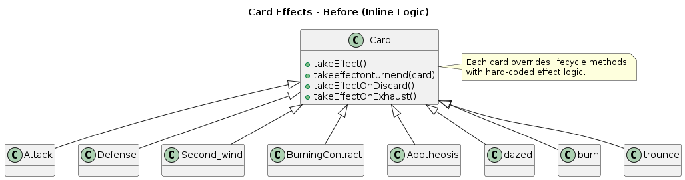
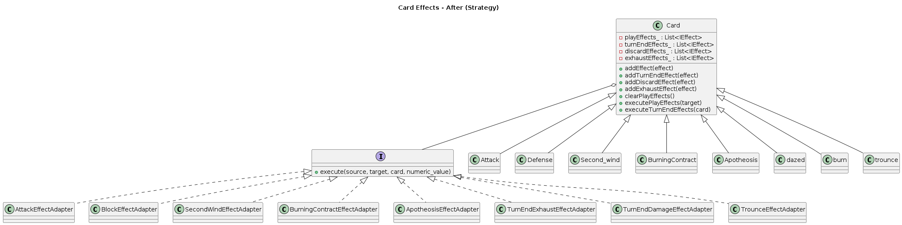

[TOC]


# Strategy Pattern
## 1. Brief Introduction to Strategy Pattern

### 1.1 What is Strategy Pattern

The **Strategy Pattern** is a behavioral design pattern that defines a family of algorithms, encapsulates each one, and makes them interchangeable. A client (the context) holds a reference to a strategy interface and delegates execution to the chosen strategy at runtime. Changing behavior is therefore a matter of swapping strategies rather than modifying the client itself.

### 1.2 Key Components

- **Context**: The object that uses strategies. In this refactor, each `Card` instance acts as the context and delegates its lifecycle behaviors to strategies.
- **Strategy Interface**: A common contract for interchangeable behaviors. `IEffect` provides a unified signature for card effects across lifecycles.
- **Concrete Strategies**: Specific implementations of behaviors (deal damage, gain block, upgrade all cards, exhaust at turn end, apply debuffs, etc.).
- **Composition**: The context aggregates strategies for different lifecycles (play, turn-end, discard, exhaust) and executes them in order. This keeps the card thin and makes behaviors pluggable.

---

## 2. Previous Implementation and Problems

### 2.1 Original Implementation Approach

Previously, every card subclass overrode `takeEffect()` and sometimes other lifecycle hooks (`takeeffectonturnend`, `takeEffectOnDiscard`, `takeEffectOnExhaust`). Each card hard-coded its logic, even when behaviors were identical. Multi-phase cards mixed UI flow, flags, and gameplay in single methods, making reasoning and reuse difficult.

**Example: Attack (inline damage)**
```cpp
class Attack : public Card {
public:
    Attack() : Card("Attack", "Deal 6 damage", 1, 20, COMMON, PLAYABLE, ATTACK, YES, NO, NO) {}
    void upgrade() {
        is_upgraded_ = 1;
        name_ += '+';
        description_ = "Deal 9 damage";
    }
    void takeEffect(std::shared_ptr<Creature> target) {
        int temp_attack = 6;
        if (is_upgraded_) temp_attack += 3;
        CombatSystem::getInstance()->onAttack(Player::getInstance(), target, temp_attack, "Attack");
    }
};
```

**Example: BurningContract (multi-phase, mixed UI + gameplay)**
```cpp
class BurningContract : public Card {
public:
    void takeEffect() {
        int draw_num = 2;
        if (is_upgraded_) draw_num += 1;
        if (tag == 0) {
            HandPileLayer::getInstance()->removeFromParent();
            auto selectScene = SelectScene::create();
            auto selectScenePtr = dynamic_cast<SelectScene*>(selectScene);
            auto scene = dynamic_cast<CombatScene*>(Director::getInstance()->getRunningScene());
            selectScenePtr->setCombatScene(scene);
            HandPileLayer::getInstance()->card_num_select_target = 1;
            cocos2d::Director::getInstance()->pushScene(selectScene);
        }
        if (tag == 1) {
            CombatSystem::getInstance()->drawCard(draw_num);
            HandPileLayer::getInstance()->adjustHandPile();
            tag = 0;
        }
    }
};
```

**Example: Turn-end status (dazed)**
```cpp
class dazed : public Card {
public:
    dazed() : Card("dazed", "Cannot be hit", 0, 0, NORMAL, FALSE, STATUS, NO, NO, NO) {};
    void takeeffectonturnend(std::shared_ptr<Card> card) {
        CombatSystem::getInstance()->exhaustCard(card);
    }
};
```

### 2.2 Problems with Original Approach

**1. Duplication**
- Damage, block, draw, upgrade logic repeated across many cards.
- Upgraded variants copied entire methods with minor numeric tweaks.

**2. Mixed Concerns**
- Gameplay, UI flow, and state flags (e.g., `tag`) tangled together.
- Multi-phase flows were spread across conditional branches instead of encapsulated behaviors.

**3. Low Composability**
- Combining effects (attack + debuff, or draw + exhaust) required bespoke code each time.
- Common primitives could not be reused cleanly without deep inheritance.

**4. Upgrade Fragility**
- Upgrades required editing method bodies and keeping base/upgraded logic in sync, risking divergence.

**5. Lifecycle Scatter**
- Turn-end, discard, and exhaust behaviors were hard-coded per card; status effects were not reusable.

**6. Testing Difficulty**
- No small, swappable units; effects tightly coupled to singletons and UI.
- Deterministic tests (fixed damage/draw) were cumbersome to set up.

### 2.3 Specific Pain Points

- **BurningContract**: Two-phase flow with UI push and draw logic interleaved; relies on `tag` flag and is error-prone.
- **Second_wind**: Exhaust loop and block gain repeated inline; hand iteration risked index errors.
- **Apotheosis**: Global upgrade logic duplicated for multiple piles; no shared implementation.
- **Status cards (dazed/burn)**: Turn-end effects embedded in the card; not reusable for other status designs.
- **Composite effects (trounce)**: Attack plus vulnerability implemented as custom code; no shared building blocks.

---

## 3. Overall Refactoring Design

### 3.1 Architecture Overview

The refactor applies Strategy at each lifecycle hook of a card. The card owns vectors of strategies and delegates execution to them. Upgrades swap strategies instead of rewriting logic.

```
Card (Context)
  ├─ playEffects_    : vector<IEffect>
  ├─ turnEndEffects_ : vector<IEffect>
  ├─ discardEffects_ : vector<IEffect>
  └─ exhaustEffects_ : vector<IEffect>

IEffect (Strategy Interface)
  └─ execute(source, target, card, numeric_value)

Concrete Strategies (family)
  ├─ AttackEffectAdapter
  ├─ BlockEffectAdapter
  ├─ SecondWindEffectAdapter
  ├─ BurningContractEffectAdapter
  ├─ ApotheosisEffectAdapter
  ├─ TurnEndExhaustEffectAdapter
  ├─ TurnEndDamageEffectAdapter
  └─ TrounceEffectAdapter
```

### 3.2 Design Decisions

**1) Composition over Inheritance**
- Cards assemble behaviors via strategies, avoiding deep hierarchies and duplicated overrides.

**2) Lifecycle Separation**
- Dedicated vectors for play/turn-end/discard/exhaust remove conditional logic about when to run behaviors.
- Each lifecycle has an explicit execution point and container, so adding a new turn-end/status rule or discard trigger does not require touching play logic.

**3) Upgrade via Replacement**
- Upgrades clear and replace strategies (`clearPlayEffects()` + re-add), eliminating branching inside behavior code.
- This keeps the mental model simple: “upgraded card = different strategy set,” mirroring how relics or buffs swap modifiers at runtime.

**4) Unified Interface**
- Single `IEffect::execute` signature across lifecycles; the invoked lifecycle determines semantics.
- `numeric_value` remains available for chained or stateful effects that need to accumulate or pass intermediate values, preserving flexibility.

**5) Multi-Phase Encapsulation**
- Complex flows (select → resolve) live inside a strategy class, keeping card code thin and readable.
- Phase state (e.g., `card->tag`) is localized inside the strategy rather than spread across multiple branches in the card.

**6) Backward Compatibility**
- External callers (CombatSystem, scenes) remain unchanged; default hooks delegate to strategies.
- The refactor is internal to cards; no other systems need to be aware of the Strategy migration.

### 3.3 UML Class Diagram

- **Before Refactoring**: 

- **After Refactoring**: 


### 3.4 Strategy Application Example (BurningContract)

- Phase handling stays inside `BurningContractEffectAdapter`:
  - Phase 0: push selection scene, set `card_num_select_target`.
  - Phase 1: draw cards (base + upgrade bonus), adjust hand, reset `tag`.
- Card code simply calls `executePlayEffects()`.

---

## 4. Detailed Implementation

### 4.1 Core File Changes

**Modified**
- `Classes/Card.h`
  - Added lifecycle strategy vectors: `playEffects_`, `turnEndEffects_`, `discardEffects_`, `exhaustEffects_`.
  - Added helpers: `addPlayEffect`, `addTurnEndEffect`, `addDiscardEffect`, `addExhaustEffect`, `clearPlayEffects`, `executePlayEffects`, `executeTurnEndEffects`, `executeDiscardEffects`, `executeExhaustEffects`.
  - Default lifecycle methods delegate to strategy execution.
- `Classes/Card.cpp`
  - Card subclasses compose strategies in constructors; upgrades swap strategies.
- `Classes/IncludeAll.h`
  - Includes new strategy headers.

**Added Strategies**
- `Classes/BurningContractEffectAdapter.h`
- `Classes/ApotheosisEffectAdapter.h`
- `Classes/TurnEndExhaustEffectAdapter.h`
- `Classes/TurnEndDamageEffectAdapter.h`
- `Classes/TrounceEffectAdapter.h`
*(Existing adapters reused: `AttackEffectAdapter`, `BlockEffectAdapter`, `SecondWindEffectAdapter`.)*

### 4.2 Strategy Interface

```cpp
class IEffect {
public:
    virtual ~IEffect() = default;
    virtual void execute(std::shared_ptr<Creature> source = nullptr,
                         std::shared_ptr<Creature> target = nullptr,
                         std::shared_ptr<Card> card = nullptr,
                         int& numeric_value = 0) = 0;
};
```

Characteristics:
- Single entry point for all effect behaviors.
- Optional parameters allow reuse across lifecycles; unused inputs can be ignored.
- `numeric_value` can act as accumulator or passthrough for chained behaviors if needed.

### 4.3 Card Helpers (Lifecycle Delegation)

```cpp
// Play effects
void addEffect(std::shared_ptr<IEffect> effect) { addPlayEffect(effect); }
void addPlayEffect(std::shared_ptr<IEffect> effect);
void clearPlayEffects();
void executePlayEffects(std::shared_ptr<Creature> target = nullptr);

// Turn-end effects
void addTurnEndEffect(std::shared_ptr<IEffect> effect);
void executeTurnEndEffects(std::shared_ptr<Card> card);

// Discard effects
void addDiscardEffect(std::shared_ptr<IEffect> effect);
void executeDiscardEffects();

// Exhaust effects
void addExhaustEffect(std::shared_ptr<IEffect> effect);
void executeExhaustEffects();
```

Default lifecycle implementations:
```cpp
virtual void takeEffect() { executePlayEffects(); }
virtual void takeEffect(std::shared_ptr<Creature> target) { executePlayEffects(target); }
virtual void takeeffectonturnend(std::shared_ptr<Card> card) { executeTurnEndEffects(card); }
virtual void takeEffectOnDiscard() { executeDiscardEffects(); }
virtual void takeEffectOnExhaust() { executeExhaustEffects(); }
```

### 4.4 Concrete Strategy Examples

**AttackEffectAdapter**
- Input: damage amount.
- Action: `CombatSystem::onAttack(Player::getInstance(), target, damage, cardName)`.
- Upgrade: swap adapter with higher damage in card upgrade.

**BlockEffectAdapter**
- Input: block amount.
- Action: `CombatSystem::Addblock(source, block)`.

**SecondWindEffectAdapter**
- Input: block per non-attack card.
- Action: exhaust all non-attack cards in hand; add block per exhausted card; safely handles hand reindexing.
- Upgrade: swap adapter with increased block per card.
- Notes: uses the current hand view from `CombatSystem`, decrements the loop index after exhaust to avoid skipping cards, and leaves attack cards untouched.

**BurningContractEffectAdapter**
- Input: base draw, upgrade bonus.
- Action: two-phase flow managed by `card->tag`:
  - Phase 0: push selection UI; set selection count.
  - Phase 1: draw cards (base + bonus if upgraded); adjust hand; reset tag.
- Notes: phase handling is encapsulated so the card class no longer mixes UI and resolution; the adapter can later be extended to support different selection counts without touching the card.

**ApotheosisEffectAdapter**
- Action: upgrade cards in hand, discard pile, and draw pile; preserves queue order by pop/push cycle.
- Notes: the adapter traverses queues without changing order, ensuring draw/discard order stability while applying upgrades.

**TurnEndExhaustEffectAdapter**
- Action: exhaust the card at turn end (used by dazed).

**TurnEndDamageEffectAdapter**
- Input: damage amount.
- Action: damage the player at turn end (used by burn).

**TrounceEffectAdapter**
- Input: base damage, base vulnerability, upgrade deltas.
- Action: attack target, then apply vulnerability; upgrade increases both values.

### 4.5 Card Composition Patterns

- **Simple Play Effect** (Attack, Defense): add one play strategy; upgrade swaps to stronger strategy.
- **Composite Play Effect** (trounce): add multiple play strategies (attack + debuff) or use a composite strategy.
- **Turn-End Status** (dazed, burn): attach turn-end strategies; the card’s turn-end hook simply delegates.
- **Multi-Phase** (BurningContract): strategy holds internal phase via `card->tag`; the card remains thin.
- **Global Effect** (Apotheosis): single strategy touching multiple piles.
- **Future Discard/Exhaust**: discard/exhaust vectors are ready for cards that trigger on those events (no engine changes needed).

### 4.6 Upgrade Handling

- Upgrades mark `is_upgraded_`, adjust name/description/energy if needed, then swap strategies:
```cpp
void upgrade() override {
    is_upgraded_ = 1;
    name_ += '+';
    clearPlayEffects();
    addEffect(std::make_shared<AttackEffectAdapter>(9)); // upgraded damage
}
```
- Keeps base and upgraded behavior aligned without branching inside strategy logic.
- Upgrades stay reversible in design discussions: swapping strategies makes it clear what changed and minimizes risk of leaving stale logic paths.

### 4.7 Lifecycle Execution Order

- Play effects execute in insertion order; multiple strategies can be chained.
- Turn-end effects execute in insertion order; suitable for stacking status behaviors.
- Discard/exhaust effects are wired for future cards; no change to CombatSystem calls.
- Deterministic order makes behavior predictable for design and testing; new strategies can be inserted in a known sequence.

### 4.8 Compatibility and Integration

- `CombatSystem` still calls `takeEffect*`; no signature changes.
- Card registration macros unchanged.
- Scene/UI flows are preserved; strategies call the same underlying systems.
- Existing singletons remain in use; DI can be layered later if desired.
- No external API churn: save/load, rendering, and combat loops continue to work without adjustments.

---

## 5. Advantages of Refactored Design

### 5.1 Separation of Concerns

Card classes declare *what* behaviors they own by composing strategies; strategies encode *how* to execute them. Lifecycle separation (play, turn-end, discard, exhaust) prevents phase-specific logic from being mixed in a single method.
```cpp
// Card stays declarative
Attack::Attack() {
    addEffect(std::make_shared<AttackEffectAdapter>(6));
}
void Attack::upgrade() {
    is_upgraded_ = 1; name_ += '+';
    clearPlayEffects();
    addEffect(std::make_shared<AttackEffectAdapter>(9));
}
// Behavior lives in strategy
void AttackEffectAdapter::execute(...) {
    CombatSystem::getInstance()->onAttack(Player::getInstance(), target, damage_, card ? card->getName() : "");
}
```

### 5.2 Reusability

Shared primitives (damage, block, global upgrade, turn-end exhaust/damage) are encapsulated and reused across cards. New cards can be created by combining existing strategies, avoiding duplicated code.
```cpp
// Reuse the same block strategy on different cards
Defense::Defense() { addEffect(std::make_shared<BlockEffectAdapter>(5)); }
SomeOtherShieldCard::SomeOtherShieldCard() {
    addEffect(std::make_shared<BlockEffectAdapter>(12)); // same strategy class, different param
}
```

### 5.3 Extensibility

New behaviors are added by introducing new strategy classes, not by editing existing cards or systems (Open/Closed Principle). Composite behaviors are built by assembling multiple strategies or specialized composites.
```cpp
// Add a new HealEffectAdapter without touching Card or CombatSystem
class HealEffectAdapter : public EffectAdapter {
public:
    explicit HealEffectAdapter(int heal) : heal_(heal) {}
    void execute(std::shared_ptr<Creature> source, std::shared_ptr<Creature>, std::shared_ptr<Card>, int&) override {
        CombatSystem::getInstance()->heal(Player::getInstance(), heal_);
    }
private: int heal_;
};
// Compose it into a card
SupportCard::SupportCard() { addEffect(std::make_shared<HealEffectAdapter>(8)); }
```

### 5.4 Testability

Strategies are small, focused units that can be unit-tested in isolation. Cards can inject deterministic strategies for tests. Multi-phase flows contained within a single strategy are easier to drive and assert.
```cpp
// Example: test AttackEffectAdapter with a fake target
auto adapter = std::make_shared<AttackEffectAdapter>(10);
int dummy = 0;
adapter->execute(Player::getInstance(), mockTarget, mockCard, dummy);
// Assert mockTarget received 10 damage (via a spy or fake CombatSystem)
// For multi-phase: preset card->tag = 1, then call BurningContractEffectAdapter to assert draw count.
// For status: call TurnEndDamageEffectAdapter with a fake player and verify damage applied once.
```

### 5.5 Upgrade Safety

Upgrades swap strategies instead of branching inside monolithic methods, reducing divergence between base and upgraded variants and minimizing maintenance overhead.
```cpp
void Trounce::upgrade() {
    is_upgraded_ = 1; name_ += '+';
    clearPlayEffects();
    addEffect(std::make_shared<TrounceEffectAdapter>(8, 2, 2, 1)); // higher damage/debuff inside adapter
}
```
- Reviews become simpler: diffs show strategy replacement rather than interleaved conditionals, reducing risk of forgotten branches.

### 5.6 Backward Compatibility

External interfaces and combat flow remain unchanged; only internal behavior dispatch differs. This enables gradual adoption with low integration risk.
```cpp
// Call sites unchanged
card->takeEffect(target);             // still invoked by CombatSystem
card->takeeffectonturnend(cardPtr);   // still invoked at end of turn
// Internally, these now delegate to strategies, preserving existing call graph
```
- Save/load formats, scene transitions, and UI triggers do not change; only the implementation behind the hooks is swapped.

### 5.7 Clarity for Future Work

Lifecycle vectors make it clear where to attach new effects (discard/exhaust triggers), lowering the cognitive burden for adding new card types or status effects and keeping future refactors straightforward.
- New designers can read a card constructor to see all attached behaviors at a glance, instead of hunting through long conditional blocks.

---

## 6. Conclusion

Card behaviors are now expressed as swappable strategies per lifecycle, keeping cards declarative, behaviors reusable, upgrades safe, and testing practical. The external combat flow and interfaces remain intact, while internal flexibility increases to support new effects, status rules, and composite actions with minimal churn. This aligns the card system with the extensibility and clarity goals achieved in other pattern refactors.
